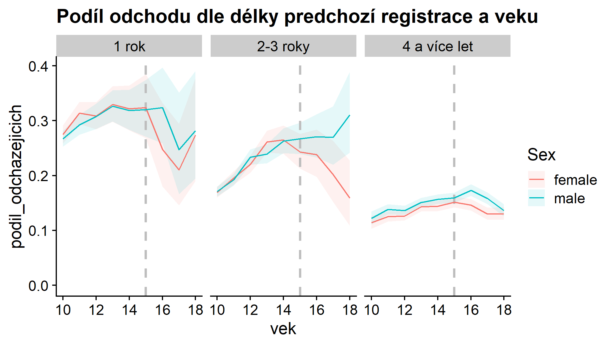

```{r setup, message=FALSE,warning=FALSE, results="hide", echo = FALSE}
source(here::here("setup_dotaznik.R"), encoding = "UTF-8")
knitr::opts_chunk$set(echo = FALSE, cache=TRUE)

# - TODO: Dát všude do popisku pťesnou formulaci otázky (asi vymyslet, aby byla v grafů)
# - TODO: Jsou roveři hozeni do vody? (asi rozházet po jednotlivých částech?)
# - TODO: Vždy text a pak obrázek
# - TODO: I ti, co odpověděli, že nikdy nebyli ve společenství si občas přivlastnili roverské role... Rozmyslet, co to znamená. (asi hlavně problém kvality dat) 
# - OTHER - jiné

```


```{r nacist_data, message=FALSE}
source(here::here("datasety_dotaznik.R"), encoding = "UTF-8")

plots <- list() 
```
```{r, cache = FALSE}
# Je z nejakeho duvodu potreba, aby fungovalo get_default_zaloha_labels pri export do Wordu
assign("zaloha_labels", zaloha_labels, envir = globalenv())
```

# Stav roveringu

Zásadní závěry z této části otázek podle nás jsou:

- Přechod ze skautského do roverského věku není sám o sobě zásadní překážkou pro udržení členů
- Nový roverský program není v podstatě nikde ve větší míře používán
- To, že kmen má určeného vůdce koreluje s celou řadou pozitivních charakteristik. Naopak absence vedení/programu nebo roverského know-how je často zmiňovaným problémem.
- Nejčastějším důvodem, proč roveři nejsou ve společenství je, že v jejich středisku není žádné funkční společenství. I tak se roveři bez společenství zapojují do aktivit, které jsou roverské.
- Registrace nám nemůže dát dobrou informaci o počtu roverských společenství
- Roveři jsou obecně velmi aktivní v organizaci.

Detaily a zdůvodnění lze nalézt v příslušných částech dokumentu.

## Jak interpretovat tato data

Pro interpretaci výsledků je potřeba připomenout, že všechny údaje jsou sebehodnocení a samozřejmě se lidé mohou lišit v tom, jak "přísní" na sebe a svá roverská společenství jsou. Nesmíme také zapomenout na možnou nepozornost nebo únavu při vyplňování --- proto zejména odpovědi, kde s něčím (ne)souhlasí jen malá procenta respondentů nelze brát příliš doslova --- je velmi těžké napsat otázku, kde se všichni shodnou (příkladem: jen 89% respondentů jednoho amerického průzkumu uvedlo, že "Férové volby jsou pro demokracii důležité") .

Text je strukturován tak, že vždy uvádíme nějaká tvrzení a za nimi je graf/tabulka, které ukazují v čem sesbíraná data tvrzení podporují.

## Životní cyklus rovera

### Vstup do roverského věku

Jedním z často zmiňovaných problémů je, že na přelomu skautského a roverského věku "ztrácíme" členy. Tuto otázku rozebíráme podrobněji v [kapitole o odchodech lidí](#odchody-lidi), zde jen zopakujeme hlavní shrnutí 

> V datech z registrace za roky 2012---2018 lze v některých skupinách členů vidět mírný vzestup míry odchodů kolem 15tého roku věku. Nejsilnější takový nárust jsme pozorovali u chlapců, kteří jsou již členy Junáka alespoň 4 roky. Ve 12ti letech opouští organizaci v průměru 14% takovýchto chlapců z ročníku (tj. zhruba jeden ze sedmi), tato míra pak roste plynule až k 16ti letům, kdy jich odchází 17% z ročníku (tj. zhruba jeden z šesti). V jiných kategoriích je nárůst odchodů kolem přechodu do roverského věku nižší. V roverském věku pak míra odchodů klesá s rostoucím věkem klesá.

> Data neukazují masivní exodus začátkem roverského věku. Nízký počet roverů je pravděpodobně více ovlivněn výrazným poklesem přílivu nováčků s rostoucím věkem a celkově vysokým "odpadem" nováčků (až 33% prvně registrovaných se neregistruje podruhé) i zkušenějších členů (až 18% z ročníku) napříč skautským věkem. Odchod člena v rovererském věku je také pro středisko závažnější, což může subjektivně vést ke zveličování počtu odchodů.

To lze též shrnout obrázkem:



_Zde vidíme, jaká část členské základny Junáka daného věku odešla během sledovaného období, rozděleno na nováčky (registrují se poprvé) a ostatní. Raději příklad: kdyby za roky 2012---2018 období bylo v Junáku celkem 1000 chlapců, kteří se poprvé registrovali během svých 13ti let a z toho se jich 200 již znovu neregistrovalo, bude v grafu 0.2. Pruh kolem údajů ukazuje očekávanou nejistotu/šum (čím méně lidí v kategorii, tím méně si jsme jisti, že to co vidíme je reprezentativní). Pozorovaný nárůst odchodů mužských členů s 2---3 letou zkušeností v roverském věku není příliš zásadní, protože absolutní počet těchto členů je nízký. _

```{r}
if(any(hlavni_data$let_v_junaku < hlavni_data$let_v_kmeni, na.rm = TRUE)) {
  stop("Nekdo byl dele v Junaku nez v kmeni")
}

data_vstupy <- hlavni_data %>% mutate(
  vek_vstupu_do_kmene = if_else(kategorie_respondenta_full == "nyni_spolecenstvi", age - let_v_kmeni, NA_real_),
  vek_vstupu_do_junaka = age - let_v_junaku,
  vekova_skupina = cut(age, c(14,17,20,23,26)))

podile_vstoupili_do_11ti_let <- mean(data_vstupy$vek_vstupu_do_junaka < 11, na.rm = TRUE)

```


Respondenti tomuto odpovídají --- `r scales::percent(podile_vstoupili_do_11ti_let)` jich vstoupilo do Junáka když jim bylo méně než 11 let.

Bavíme-li se o vstupu do roverského společenství, málokdo vstupuje do kmene později než těsně po skautském věku.

```{r, fig.cap='Rozložení věku vstupu do kmene. Věk vstupu určen z otázek "Jak dlouho jsi ve společenství" a "Věk", proto lze určit jen u těch, kdo nyní jsou ve společenství.'}


plot_vek_vstupu_base <- data_vstupy %>% filter(!is.na(vek_vstupu_do_kmene)) %>%
  ggplot(aes(x = vek_vstupu_do_kmene)) + geom_histogram(binwidth = 1) + vodorovne_popisky_x + 
  scale_x_continuous(breaks = c(13, 15, 18, 21, 24))
plots$vek_vstupu_do_kmene <- plot_vek_vstupu_base +
  ggtitle("Věk vstupu do kmene", "Jen členi společenství")

plots$vek_vstupu_do_kmene
```

Tato data jsou částečně zkreslena tím, že obecně máme hodně mladších respondentů (kteří nemohli vstoupit do kmene později), ale i u starších respondentů vidíme výraznou špičku vstupů mezi 15 a 17tým rokem.

```{r}
plots$vek_vstupu_do_kmene_skupiny <- plot_vek_vstupu_base + 
  facet_wrap(~vekova_skupina) +   
  ggtitle("Věk vstupu do kmene", "Jen členi společenství, rozděleno dle současného věku respondentů")

plots$vek_vstupu_do_kmene_skupiny  

```


#### Čím si prošli před vstupem

Vícekrát jsme se setkali s doměnkou, že nefunkční družinový systém je příčinou problémů roveringu. Slušné množství roverů přichází z oddílů, kde družinový systém aspoň trochu fungoval, takže se na to nemůžeme tolik vymlouvat (jakkoliv námi položené otázky nemohou odhalit, jestli družiny skutečně fungovaly dobře). Odpovědi našich respondentů jsou ostatně velmi podobné výsledkům z nedávných sond o družinovém systému.

```{r}
plots$fungovani_skautskeho_oddilu <- plot_summary_mc(hlavni_data, fungovani_skautskeho_oddilu, "Moje družina ve skautském věku") 
plots$fungovani_skautskeho_oddilu

# TODO: korelace problémů roveringu s odpovědmi o družinovém systému
```


Zároveň většina lidí, co v Junáku vytrvala až do roverského věku,  byla výrazně aktivní již ve skautském věku (_pozn.: otázka v průzkumu se ptala, co zažili --- bez upřesnění kdy, tudíž nelze vyloučit, že někteří byli rádci/podrádci či účastníci rádcovského kurzu až v roverském věku_).

```{r}
plots$zazil_radce <- hlavni_data %>% plot_summary_mc(co_zazil, "Co zažili ve skautingu", subtitle = "jen otázky k rádcování", include_values = c("radce_podradce", "radcovsky_kurz"))
plots$zazil_radce
```

#### Vlastní vstup

Jak vypadá vlastní přechod do roverského věku? Tady je opět těžká interpretace: necelých 60% uvedlo, že mělo snadný přechod. Je to úspěch nebo se máme rmoutit pro dva z pěti roverů, co to dle vlastního pocitu snadné neměli? Obdobně, když si zhruba polovina roverů myslí, že byla připravena se aspoň trochu podílet na přípravě programu rovesrkého společenství, je to hodně nebo málo?

Ptali jsme se též, jestli se roverem stanu "automaticky" když dovrším skautský věk. Vypadá to, že zhruba v polovině středisek tento přechod automatický není a nejspíš se tedy rozlišuje mezi "roverem" a "členem v roverském věku".

```{r}
vyroky_vstup <- c("rover_automaticky","vstupni_ritual","snadny_prechod", "pri_prechodu_schopny")
plots$vyroky_zazil_vstup <- plot_summary_mc(hlavni_data, vyroky_o_roveringu_zazil_2, "Rovering, který jsem zažil", subtitle = "jen otázky ke vstupu do roverského věku", include_values = vyroky_vstup)
plots$vyroky_zazil_vstup
```

Můžeme se též podívat, jak se odpovědi mění s věkem --- zde nejspíš půjde hlavně o tzv. _kohortový efekt_, kdy lidé různého věku zažili různý skauting, ale může zde být i rozdíl v tom, jak stejnou věc hodnotí mladší a starší respondenti.

```{r}
plots$vyroky_zazil_vstup_vek <- hlavni_data  %>% plot_binarni_s_nejistotou(paste0("vyroky_o_roveringu_zazil_2.",vyroky_vstup), by = age, facet = TRUE, na.rm = TRUE, names_prefix = "vyroky_o_roveringu_zazil_2.") + plot_annotation(paste0("Rovering, který jsem zažil"))

plots$vyroky_zazil_vstup_vek
```

Jedna z otázek RO byla, zda "automatický" přechod znamená též přechod “bez rituálu”. To se z dat nezdá jako pravděpodobné. Naopak všechny čtyři kombinace těchto možností jsou celkem podobně zastoupeny, jakkoliv ze členů přijatých do roveringu "automaticky" jich rituálem projde více.:

```{r}
hlavni_data %>% filter(!is.na(vyroky_o_roveringu_zazil_2)) %>%
  rename(rover_automaticky = vyroky_o_roveringu_zazil_2.rover_automaticky, vstupni_ritual = vyroky_o_roveringu_zazil_2.vstupni_ritual) %>%
  group_by(rover_automaticky, vstupni_ritual) %>%
  summarise(pocet = n()) %>%
  ungroup() %>%
  mutate(podil = scales::percent(pocet / sum(pocet)),
         rover_automaticky = if_else(rover_automaticky, "Ano", "Ne"),
         vstupni_ritual = if_else(vstupni_ritual, "Ano", "Ne"))
```

A co ti, co do společenství nikdy nevstoupili (ale již nejsou v oddíle mladších členů)? To je zhruba `r scales::percent(sum(hlavni_data$kategorie_respondenta_full == "nikdy_spolecenstvi_starsi") / nrow(hlavni_data))` respondentů.


#### Pohled nečlenů

```{r}
podil_neroveru_bez_informaci <- mean(hlavni_data$vyroky_o_roveringu_stredisko.nevim, na.rm=TRUE)
```

Data ukazují, že jen malá část roverů funguje MIMO roverské společenství ve střediscích, kde funkční roverské společenství existuje (a ví o něm). Naopak respondenti, kteří označili, že nikdy nebyli součástí společenství běžně uvádějí, že roveři v jejich středisku "Nemají definovanou úlohu".

Z lidí v roverském věku, kteří nikdy nebyli ve společenství jich `r scales::percent(podil_neroveru_bez_informaci)` označilo, že o roverech na středisku nemá informace. To je sice malé číslo, zároveň to je jedna z věcí, kde lze snáze něco změnit.

```{r}
plots$vyroky_o_roveringu_stredisko_informace <- plot_summary_mc(hlavni_data, vyroky_o_roveringu_stredisko, "O roverech v mém středisku platí", subtitle = "(jen ti, co již nejsou v mladším oddíle a nikdy nebyli ve společenství)", include_values = c("je_spolecenstvi","pravidelne","bez_ulohy", "vlastni_akce", "nejsou", "nevim"))
plots$vyroky_o_roveringu_stredisko_informace


```

V otázkách výše je taky vidět, že "mít vlastní akce" je (z pohledu lidí, co se na společenství dívají z vnějšku) o dost snažší naplnit než "funkční společenství". 


### Život ve společenství

Asi nepřekvapí, že většina roverských společenství (kmenů) je malá. Jen kolem pětiny roverů je ve společenstvích s více jak 20 členy. Zajímavé ale může být, že mikro společenství (do 5 členů) je jen minimum. _(Ač zde je možné, že někteří respondenti v malých společenství uvedli, že v žádném společenství nejsou)_.


```{r}
plots$pocet_clenu_spolecenstvi <- plot_summary_mc(hlavni_data, pocet_clenu_spolecenstvi, order_by_podil = FALSE, invert_color_threshold =  0.03)
plots$pocet_clenu_spolecenstvi

```

Naprostá většina společenství je koedukovaná, naopak jen malá část roverů si myslí, že jejich společenství je/bylo jen pro jednu generaci. Dělení na starší a mladší roverský věk se také jeví spíše jako vzácnost.

```{r}
plots$vyroky_o_roveringu_zazil_zivot <- plot_summary_mc(hlavni_data, vyroky_o_roveringu_zazil, "Rovering, který jsem zažil", subtitle = "jen části týkající se života v kmeni", include_values = c("pro_jednu_gen", "koedukovany", "spoluprace_mimo_stredisko")) 
plots$vyroky_o_roveringu_zazil_zivot

```

```{r}
vyroky_zazil_obecne <- c("mladsi_starsi", "prechodovy_ritual", "jasne_ukonceni", "jak_dlouho_chci", "roversky_slib")
plots$vyroky_o_roveringu_zazil_2 <- plot_summary_mc(hlavni_data, vyroky_o_roveringu_zazil_2, "Rovering, který jsem zažil 2", include_values = vyroky_zazil_obecne, subtitle = "jen části týkající se života v kmeni")
plots$vyroky_o_roveringu_zazil_2

```

Můžeme se podívat, jak se odpovědi liší s věkem. Nějaký trend je u dělení na mladší a starší a "roverem můžu být, jak dlouho chci" --- zde asi hlavním mechanismem bude, že mladší roveři s roverským stárnutím nemají zkušenost. Jinak se s věkem/kohortou odpovědi příliš nemění.

```{r}
plots$vyroky_zazil_obecne_vek <- hlavni_data  %>% plot_binarni_s_nejistotou(paste0("vyroky_o_roveringu_zazil_2.",vyroky_zazil_obecne), by = age, facet = TRUE, na.rm = TRUE, names_prefix = "vyroky_o_roveringu_zazil_2.") + plot_annotation(paste0("Rovering, který jsem zažil 2"))

plots$vyroky_zazil_obecne_vek
```


#### Frekvence akcí

Ptali jsme se též na frekvenci akcí, ale jen současných členů (nevěřili jsme, že bývalí si to budou dobře pamatovat). Hrubá čísla asi nepřekvapí --- většina roverů má tu a tam nějakou akci, velmi aktivních i zcela neaktivních kmenů je málo.

```{r}
if(sum(hlavni_data$frekvence_kratkych_akci < "mesicne", na.rm = TRUE) !=
   sum(hlavni_data$frekvence_kratkych_akci %in% c("nevyplneno", "nikdy","rocne","nekolik_rocne"), na.rm = TRUE)) {
  stop("Neplatny ordering")
}

```

```{r}
plots$frekvence_kratkych_akci <- plot_summary_mc(hlavni_data, frekvence_kratkych_akci, "Frekvence kratších akcí", order_by_podil = FALSE, invert_color_threshold = 0.03)
plots$frekvence_kratkych_akci

```

```{r}
plots$frekvence_vicedennich_akci <- plot_summary_mc(hlavni_data, frekvence_vicedennich_akci, "Frekvence vícedenních akcí", order_by_podil = FALSE, invert_color_threshold = 0.03)
plots$frekvence_vicedennich_akci

```
```{r}
plots$frekvence_velkych_akci <- plot_summary_mc(hlavni_data, frekvence_velkych_akci, "Frekvence velkých akcí", order_by_podil = FALSE)
plots$frekvence_velkych_akci

```


Nabízí se otázka, jak častá jsou společenství, které mají např. málo vícedenních akcí, ale pravidelně jezdí na expedice? Nebo mají hodně krátkých akcí, ale téměř žádné větší. Obojí se zdá být dosti vzácné; frekvence různých druhů akcí spolu celkem dobře koreluje. Následující obrázky ukazují jak časté jsou různé kombinace frekvencí krátkých, delších a velkých akcí (čím tmavší tím častější, barva pozadí znemaná, že tuto kombinaci nikdo nevyplnil). Vidíme, že "tmavé oblasti"  jsou tam, kde je buď málo všech druhů akcí nebo celkem dost všech druhů akcí.

```{r}
hlavni_data %>% 
  filter(frekvence_kratkych_akci != explicit_na_level) %>%
  group_by(frekvence_kratkych_akci, frekvence_vicedennich_akci) %>%
  summarise(pocet = n()) %>%
  group_by(frekvence_kratkych_akci) %>%
  mutate(podil_vicedennich = pocet / sum(pocet)) %>%
  ggplot(aes(x = frekvence_kratkych_akci, y = frekvence_vicedennich_akci, fill = podil_vicedennich)) + 
  geom_raster() + scale_x_discrete() + scale_y_discrete() + scale_fill_revize(discrete = FALSE)

hlavni_data %>%
  filter(frekvence_kratkych_akci != explicit_na_level) %>%
  group_by(frekvence_velkych_akci, frekvence_vicedennich_akci) %>%
  summarise(pocet = n()) %>%
  group_by(frekvence_vicedennich_akci) %>%
  mutate(podil_velkych = pocet / sum(pocet)) %>%
  ggplot(aes(x = frekvence_vicedennich_akci, y = frekvence_velkych_akci, fill = podil_velkych)) +
  geom_raster() + scale_x_discrete() + scale_y_discrete() + scale_fill_revize(discrete = FALSE)

```


```{r}

# ### Pohled nečlenů
# 
# Jak jsou aktivní roveři pohledem roverů mimo společenství? 
# 
# plots$vyroky_o_roveringu_stredisko_aktivita <- plot_summary_mc(hlavni_data, vyroky_o_roveringu_stredisko, "O roverech v mém středisku platí", subtitle = "(jen ti, co již nejsou v mladším oddíle a nikdy nebyli ve společenství)", include_values = c("je_spolecenstvi","pravidelne","vlastni_akce", "rozviji_se"))
# plots$vyroky_o_roveringu_stredisko_aktivita
```


#### Jak roversky žijí rádci?

Dotaz od Ifanky: Jak jsou na tom rádci u oddílů / u družin s aktivitou (jde mi asi hlavně o ty mladší) --- jak často jezdí na akce, vzdělávačky, jednoduše jak jsou aktivní?

Podívali jsme se tedy na respondenty do 18ti let včetně a porovnali ty, kteří zaškrtli "Oddílový rádce" nebo "Družinový rádce" jako jednu ze svých rolí. Ve frekvenci akcí nebo tom, jaké kurzy zažili se nezdá být velký rozdíl od "zbytku populace". 


```{r}
data_mladsi_radce <- hlavni_data %>% filter(age <= 18) %>% mutate(mladsi_radce = if_else(age <= 18 & (role_skauting.oddilovy_radce | role_skauting.druzinovy_radce), "Ano", "Ne")) 

# data_mladsi_radce %>%
#   plot_frekvence_by("frekvence_kratkych_akci", mladsi_radce)
#                                               
data_mladsi_radce %>%
  plot_frekvence_by("frekvence_vicedennich_akci", mladsi_radce) + plot_annotation("Frekvence vícedenních akcí", "členové do 18ti let včetně")

# data_mladsi_radce %>%
#   plot_frekvence_by("frekvence_velkych_akci", mladsi_radce)

  # plot_summary_mc(frekvence_kratkych_akci, "Frekvence krátkých akcí", subtitle = "Jen do 20ti let, oddíloví, družinoví rádci" , order_by_podil = FALSE)

# hlavni_data %>% filter(age < 20, role_skauting.oddilovy_radce | role_skauting.druzinovy_radce) %>%
#   plot_summary_mc(frekvence_vicedennich_akci, "Frekvence vícedenních akcí", subtitle = "Jen do 20ti let, oddíloví, družinoví rádci" , order_by_podil = FALSE)

```

```{r, fig.cap='spolecenstvi_kurzy_akce se vztahuje k oblasti "Označ všechny výroky, které platí o roveringu, který jsi sám zažil" a otázce "Jezdíme na skautské kurzy a/nebo celostátní akce.". Ostatní hodnoty se týkají oblasti "Co jsi v Junáku zažil/absolvoval?" '}
data_mladsi_radce %>% rename(co_zazil.spolecenstvi_kurzy_akce = vyroky_o_roveringu_zazil.kurzy_akce) %>% plot_binarni_s_nejistotou(c( "co_zazil.spolecenstvi_kurzy_akce", "co_zazil.cekatelky", "co_zazil.roversky_kurz", "co_zazil.vudcovky", "co_zazil.jiny_kurz"), by = mladsi_radce, names_prefix = "co_zazil.", flip = TRUE, legend_label = "Je mladší rádce", na.rm = TRUE)+ plot_annotation("Jaké kurzy zažili", "členové do 18ti let včetně")
```


### Nástroje roverského programu

```{r}

klicove_nastroje_text <- names(popisky_voleb(hlavni_data, vychovne_nastroje)[popisky_voleb(hlavni_data, vychovne_nastroje) %in% klicove_nastroje_id])

data_klicove_nastroje <- hlavni_data %>% 
  filter(!is.na(vychovne_nastroje))

data_klicove_nastroje_shrnuto <- data_klicove_nastroje %>% 
  group_by(pocet_klicovych_nastroju) %>%
  summarise(pocet = n()) %>%
  ungroup() %>%
  mutate(podil = pocet / sum(pocet))

podil_kmen_max_3_nastroje <- sum(
  data_klicove_nastroje_shrnuto %>% filter(pocet_klicovych_nastroju <= 3) %>% pull(podil))
podil_kmen_min_5_nastroju <- sum(
  data_klicove_nastroje_shrnuto %>% filter(pocet_klicovych_nastroju >= 5) %>% pull(podil))

pocet_kmen_8_nastroju <- data_klicove_nastroje_shrnuto %>% filter(pocet_klicovych_nastroju == 8) %>% pull(pocet)
pocet_respondentu_nastroje <- sum(!is.na(hlavni_data$vychovne_nastroje))
```


Respondentům jsme dali na výběr širokou paletu možných nástrojů roverského programu a měli označit, které se používají u nich ve společenství. Devět z těchto nástrojů jsme si označili za klíčové: 

`r paste0("* ",klicove_nastroje_text, collapse="\r\n ")`. 

Všimněte si, že pojmenování je spíše širší než užší, tj. pod "Výzvu" nebo "Projekt" se vejde ledacos, "Velké roverské akce" si nemuseli všichni vyložit jako "Obrok a spol." a mohli do toho třeba zahrnout expedice apod. (což je problém který jsme si uvědomili až při vyhodnocování dotazníku). 

Přes široké pojetí otázek, `r scales::percent(podil_kmen_max_3_nastroje, accuracy = 2)` respondentů je v kmeni, který použivá jen tři nebo méně z těchto nástrojů a jen `r scales::percent(podil_kmen_min_5_nastroju, accuracy = 2)` jich používá více jak polovinu. Z `r pocet_respondentu_nastroje` respondentů, kteří na otázku odpovídali, jen `r pocet_kmen_8_nastroju` respondenti zaškrtli osm z klíčových nástrojů a všech devět nezaškrtl nikdo.

```{r}
plots$klicove_nastroje <- data_klicove_nastroje_shrnuto %>%
  ggplot(aes(x = pocet_klicovych_nastroju, y = podil)) + geom_bar(stat = "identity") + vodorovne_popisky_x + plot_annotation("Počet klíčových výchovných nástrojů", subtitle =  paste0(klicove_nastroje_id, collapse = ", ")) + scale_y_continuous("Podíl", labels = scales::percent)

plots$klicove_nastroje
```

Nijak asi nepřekvapí, že počet užitých nástrojů je vyšší u kmenů aktivních i v dalších měřítkách (například dle frekvence akcí nebo vyššího počtu členů), ač ani mezi nejaktivnějšími kmeny se příliš mnoho nástrojů nepoužívá.

```{r}
data_klicove_nastroje %>% plot_ciselne_s_nejistotou("pocet_klicovych_nastroju", by = frekvence_vicedennich_akci) + plot_annotation("Počet klíčových nástrojů", "dle frekvence vícedenních akcí")


data_klicove_nastroje %>% plot_ciselne_s_nejistotou("pocet_klicovych_nastroju", by = pocet_clenu_spolecenstvi) + plot_annotation("Počet klíčových nástrojů", "dle počtu členů ve společenství")

```

```{r}
podil_nepouziva_nic <- mean(hlavni_data$vychovne_nastroje.nic, na.rm = TRUE)
podil_pouziva_projekty <- hlavni_data %>% 
  summarise(podil = mean(vychovne_nastroje.projekty, na.rm = TRUE)) %>% pull(podil)
podil_pouziva_projekty_vyzvy <- hlavni_data %>% 
  summarise(podil = mean(vychovne_nastroje.vyzvy & vychovne_nastroje.projekty, na.rm = TRUE)) %>% pull(podil)
  
```

Podíváme-li se, které konkrétní nástroje jsou nejzastoupenější, jde o velké akce, výzvy, časopis kmen, projekty a putování. 

Hodně roverů (`r scales::percent(podil_nepouziva_nic)`) je z kmenů, které nepoužívají vůbec žádné výchovné nástroje. Přestože nezanedbatelná část roverů je v kmenech, kde se používají výzvy nebo projekty, jen `r scales::percent(podil_pouziva_projekty_vyzvy)` jich používá obojí. A to za podmínek, kdy položená otázka nedávala na obsah projektů/výzev téměř žádná omezení a jako nástroj je to tedy spíše vágní. 

Roverský začátek jako jeden z mála zcela konkrétních výstupů roverského programu používá jen hodně málo roverů.

```{r}
plots$vychovne_nastroje <- plot_summary_mc(hlavni_data, vychovne_nastroje, "Používáme tyto výchovné nástroje")
plots$vychovne_nastroje
```


Celkově si tedy myslíme, že roverský program v podstatě není téměř nikde plně zaveden, naopak ve většině kmenů jsou z něj užity jen drobky.

```{r}
#TODO: Porovnat s průzkumem na Obroku!
#TODO: Proč není zaveden? 

```


```{r}
podil_roversky_program_pomaha <- mean(hlavni_data$co_pomaha_roveringu.roversky_program, na.rm=TRUE)
```

Jen `r scales::percent(podil_roversky_program_pomaha)` respondentů uvedlo, že dle jejich zkušenosti "Roverský program vydaný Junákem" roveringu "znatelně pomáhá".

Tím, že míra zavedení (ve smyslu počtu používaných nástrojů) dost koreluje s jinými měřítky aktivity, je nepravděpodobné, že by se zde podařilo oddělit příčinu a následek, jakkoliv je určitě ještě možné se pokusit o detailnější analýzu. 

```{r}
#TODO: subset, kde je zaveden, pomáhá?
#TODO: Přispívá RSP k nějakým problémům roveringu?
#TODO: Může RSP v principu fungovat navzdory problémům roveringu?
```


#### Muži, ženy a nástroje

Musíme velmi opatrně, protože muži ve vzorku jsou celkově starší než ženy.

```{r}
# Korelace rozdílů v mužsko-ženských použití nástrojů a spokojenosti ve společenství, tj. Je něco co “cpeme holkám”? 
# TODO: rozdíly v pohlaví A ve spokojenosti --- trošku komplikované, zatím odkládám.
```

V první řadě se můžeme podívat, jak se liší použití nástrojů mezi pohlavími.

Existuje pár nástrojů, kde je rozdíl v užití mezi pohlavími, ale jedná se spíše o ty okrajové (wiki používají muži zhruba 3x častěji než ženy, naopak RoverNet používají ženy 2x častěji a diář ženy zhruba 1.5x častěji).

```{r}
data_nastroje_pohlavi <- hlavni_data %>%
  filter(!is.na(vychovne_nastroje)) %>%
  pivot_longer(starts_with("vychovne_nastroje."), names_prefix = "vychovne_nastroje.", names_to = "nastroj",
                values_to = "pouziva") %>%
  group_by(nastroj) %>%
  summarise(
    vice_u_muzu_absolutne = mean(pouziva[sex == "muz"]) - mean(pouziva[sex == "zena"]),
    vice_u_muzu_relativne = mean(pouziva[sex == "muz"]) / mean(pouziva[sex == "zena"])
    ) %>%
  ungroup()

plots$nastroje_rozdil_pohlavi_relativne <- data_nastroje_pohlavi %>%
  mutate(nastroj = fct_reorder(nastroj, vice_u_muzu_relativne)) %>%
  ggplot(aes(x = nastroj, y = vice_u_muzu_relativne)) + geom_bar(stat = "identity") + scale_y_log10("", breaks = c(0.5, 2/3,1,1.5,2), labels = c("Ženy 2x častěji", "Ženy 1.5x častěji", "Stejně", "Muži 1.5x častěji", "Muži 2x častěji")) + plot_annotation("Využívání nastrojů rovery a rangers", "Relativní rozdíl")

plots$nastroje_rozdil_pohlavi_relativne
```

Můžeme se též podívat na absolutní čísla (tj. o kolik procentních bodů se podíl uživatelů liší mezi muži a ženami). Výsledky jsou podobné, ale relativně nízké absolutní hodnoty potvrzují, že velké relativní rozdíly jsou hlavně u nástrojů, které nejsou celkově příliš používané. S výjimkou kurzů jsou mezi zásadními nástroji jen malé rozdíly. 

```{r}
plots$nastroje_rozdil_pohlavi_absolutne <- data_nastroje_pohlavi %>%
  mutate(nastroj = fct_reorder(nastroj, vice_u_muzu_absolutne)) %>%
  ggplot(aes(x = nastroj, y = vice_u_muzu_absolutne)) + geom_bar(stat = "identity") + scale_y_continuous("Podíl muži - podíl ženy", labels = scales::percent) + plot_annotation("Využívání nastrojů rovery a rangers", "Absolutní rozdíl")

plots$nastroje_rozdil_pohlavi_absolutne
#TODO zohlednit věk
```

Potvrzuje se  zkušenost z kurzů, že na ně častěji jezdí ženy --- a zde vidíme, že to nelze snadno svést na rozdílné počty roverů a rangers --- společenství, kde jsou ženy, využívají roverské kurzy častěji.


#### Kurzy

Na kurzy se taky můžeme podívat přes otázku, co sami respondenti (tedy ne jejich společenství) zažili:

```{r}
plots$co_zazil_kurzy <- hlavni_data %>% plot_summary_mc(co_zazil, "Co zažili ve skautingu", exclude_values = c("radce_podradce", "radcovsky_kurz", "__nic"))
plots$co_zazil_kurzy

aspon_jeden_kurz <- mean(hlavni_data$co_zazil %contains_any_word% c("cekatelky","vudcovky","roversky_kurz", "jiny_kurz"), na.rm = TRUE)

podil_kurzy_nastroj <- mean(hlavni_data$vychovne_nastroje.kurzy, na.rm = TRUE)
```


Obecně vidíme, že méně lidí zažilo roverský kurz, než kolik říká, že jejich společenství využívá kurzy jako nástroj (to bylo `r scales::percent(podil_kurzy_nastroj)`). Na kurzy --- zejména čekatelky --- se hodně jezdí (tedy ve vzorku roverů, který máme). Celých `r scales::percent(aspon_jeden_kurz)` respondentů bylo aspoň na jednom z kurzů zmíněných výše.

Počet účastníků kurzů samozřejmě roste s věkem respondentů, takže mezi těmi, co vydží do cca 20 let už má čekatelky za sebou kolem 80% a procento složených vůdcovek je u starších také dosti vysoké. Zde je nepravděpodobné, že by šlo z velké části o kohortový efekt (tj. že v době, kdy nyní staří roveři byli mladší se více jezdilo na kurzy) a čekal bych, že skutečně s věkem přibývá kvalifikovaných.

```{r}
plots$kurzy_vek <- hlavni_data %>% filter(!is.na(co_zazil)) %>% plot_binarni_s_nejistotou(paste0("co_zazil.", c("cekatelky","vudcovky","roversky_kurz", "jiny_kurz")), names_prefix = "co_zazil.", by = age) +  plot_annotation(title = "Kurzy, co zažili, dle věku")

plots$kurzy_vek
```

Obecně se tedy dá očekávat, že kurzy jsou dobrým místem, kde lidé v roverském věku mohou být vystaveni myšlenkám roveringu --- jen málo lidí v roverském věku je kurzy zcela netknuto.


V našem vzorku též vyšlo, že ženy o něco častěji uvádějí, že zažily roverské kurzy, ale po zohlednění rozdílů ve věku se rozdíl nezdá přesvědčivý (data zde neukazujeme).


#### Velké akce a neorganizované společenství 

> Dotaz RO: Čekali bychom, že velké akce jsou důležité pro společenství, co není moc organizované, ale data to možná nepotvrzují.

To můžeme asi posoudit jen z toho, jak velká část takových společenství velké akce využívá. Kmeny s organizací (tahoun, rada, vudce) nebo jen ty, co mají vůdce jezdí na velké akce spíše častěji než ty méně organizované, jakkoliv rozdíl je velmi malý. Jak moc jsou velké akce "důležité" z toho samozřejmě zjistit nemůžeme. 

```{r}
plot_velke_akce_organizovan <- hlavni_data %>% plot_binarni_s_nejistotou("vychovne_nastroje.velke_akce", organizace_strucne, na.rm = TRUE) + plot_annotation("Podíl kmenů užívajících velké akce", "dle různých měřítek organizace")

plot_velke_akce_organizovan
```

### Spokojenost roverů


```{r}
plots$spokojenost_rs <- hlavni_data %>% plot_summary_mc(spokojenost_clenstvim_v_rs, "Spokojenost s členstvím ve společenství", 'Přesná otázka: "Se svým členstvím v roverském společenství jsem celkově spokojena"')
plots$spokojenost_rs

# TODO: životní spokojenost!
```

Vztahy mezi rovery jsou jednoznačně věc, se kterou jsou roveři nejčastěji spokojeni a nejméně často nespokojeni.  Naopak je mnohem více roverů nespokojeno s četností akcí než je s ní spokojeno a ani polovina roverů není spokojena s náplní programu.

```{r, fig.cap='Kombinuje otázky "Označ vše, s čím jsi (byl) ve svém roverském společenství SPOKOJEN" a "Označ vše, s čím jsi (byl) ve svém roverském společenství NESPOKOJEN" --- pokud na obojí padla stejná odpověď, je to uvedeno jako "Smíšené" '}
data_s_cim_spokojen <- hlavni_data %>% filter(!is.na(s_cim_spokojen), !is.na(s_cim_nespokojen)) %>% select(starts_with("s_cim_spokojen"), starts_with("s_cim_nespokojen"))
spokojen_labels <- attributes(hlavni_data$s_cim_spokojen)$labels
for(l in spokojen_labels) {
  spokojen <- data_s_cim_spokojen[[paste0("s_cim_spokojen.",l)]]  
  nespokojen <- data_s_cim_spokojen[[paste0("s_cim_nespokojen.",l)]]  
  data_s_cim_spokojen[[paste0("spokojen_combined.",l)]] <- 
    case_when(spokojen & !nespokojen ~ "spokojen",
              nespokojen & !spokojen ~ "nespokojen",
              TRUE ~ "smisene"
              )
}

labels_spokojen <- popisky_voleb(hlavni_data, s_cim_spokojen)

data_s_cim_spokojen %>% 
  pivot_longer(starts_with("spokojen_combined"),                                                               names_prefix = "spokojen_combined.", names_to = "kategorie", values_to = "spokojen") %>% 
  group_by(kategorie, spokojen) %>% 
  summarise(pocet = n()) %>%
  group_by(kategorie) %>% 
  mutate(podil = pocet / sum(pocet), 
         spokojen = factor(spokojen, levels = c("nespokojen","smisene", "spokojen")),
         y_text = case_when(spokojen == "spokojen" ~ 0.08,
                            spokojen == "nespokojen" ~ 0.92,
                            TRUE ~ 0.5),
         text = if_else(spokojen == "smisene", "", scales::percent(podil, accuracy = 1)),
         nazev_kategorie = factor(kategorie, levels = labels_spokojen, labels = names(labels_spokojen))
         ) %>%
  
  ggplot(aes(x = nazev_kategorie, y = podil, fill = spokojen)) + geom_bar(stat = "identity") +
  geom_text(aes(x = nazev_kategorie, y = y_text, color = spokojen, label = text), family = title_family(), size = 6) +
  coord_flip() + discrete_scale("fill", "revize_test",palette = revize_pal(palette = "continuous")) + discrete_scale("color", "revize_test",palette = revize_pal(palette = "continuous", reverse = TRUE)) + guides(color = FALSE) + 
  theme(axis.text.x = element_blank(), axis.title.x = element_blank()) +
  plot_annotation("S čím jsi ve společenství (ne)spokojen ")

# plots$s_cim_spokojen <- plot_summary_mc(hlavni_data, s_cim_spokojen, title = "S čím jsi ve společenství spokojen", exclude_values = "postoj_strediska")
# plots$s_cim_spokojen
# 
# 
# 
# plots$s_cim_nespokojen <- plot_summary_mc(hlavni_data, s_cim_nespokojen, title = "S čím jsi ve společenství NEspokojen", exclude_values = "postoj_strediska") 
# plots$s_cim_nespokojen

```

Pro spokojenost s frekvencí akcí je tu jistý klesající trend s věkem --- velké výkyvy u starších roverů je třeba brát s rezervou, protože to je malý vzorek (křivka pro "nespokejen s četností akcí" je vlastně jen inverzní). Taky je možné, že se jedná alespoň částečně o kohortový efekt (tj. že roveři, co jsou dnes staří, zažili jako mladí jiný skauting/rovering i svět obecně a tak jinak hodnotí svou současnou činnost).

```{r}
# , fig.cap="Bereme zde jen současné členy, protože u bývalých členů není jasné, jak dlouho jsou již mimo společenství."

plots$spokojenost_frekvence_akci_vek <- hlavni_data %>% 
  filter(kategorie_respondenta == "nyni_spolecenstvi") %>%
  plot_binarni_s_nejistotou(c("s_cim_spokojen.cetnost_akci"), age, na.rm = TRUE) + plot_annotation("Spokojen s frekvencí akcí dle věku", "Jen současní členové")

plots$spokojenost_frekvence_akci_vek
```

Intuitivně asi čekáme, že většina nespokojených je nespokojena, protože akcí je málo a jen málo proto, že akcí je moc. Přímo jsme se na toto dělení neptali, ale můžeme to zodpovědět nepřímo tak, že se podíváme, jestli ti spokojení mají obecně více akcí.

A skutečně, čím více akcí (jakéhokoliv druhu), tím spokojenější s frekvencí akcí. Nicméně zhruba čtvrtina současných roverů je spokojená s četností "nikdy".

```{r}
plots$spokojenost_frekvence_akci_kratke_akce <- hlavni_data %>%
  filter(kategorie_respondenta == "nyni_spolecenstvi") %>%
  plot_binarni_s_nejistotou("s_cim_spokojen.cetnost_akci", frekvence_kratkych_akci, na.rm = TRUE) + plot_annotation("Spokojen s frekvencí akcí dle frekvence", "Krátké akce")
plots$spokojenost_frekvence_akci_kratke_akce  
```

Frekvence různých druhů akcí spolu dost korelují, takže grafy pro vícedenní a větší akce vypadají velmi podobně.


Trend s věkem je též vidět u spokojenosti s náplní programu, ač zde dosahuje minima kolem 20tého roku věku. Možná čistě proto, že nespokojení starší členové již ve společenství nejsou. Taky opět může jít částečně o kohortový efekt.

```{r, fig.cap="Bereme zde jen současné členy, protože u bývalých členů není jasné, jak dlouho jsou již mimo společenství."}
hlavni_data %>% 
  filter(kategorie_respondenta == "nyni_spolecenstvi") %>%
  plot_binarni_s_nejistotou(c("s_cim_spokojen.program"), age, na.rm = TRUE) + plot_annotation("Spokojen s náplní programu dle věku", "Jen současní členové")
```

### Stárnutí rovera

```{r}
podil_vic_jak_3_roky_v_kmeni <- hlavni_data %>% filter(!is.na(let_v_kmeni))  %>% summarise(podil = mean(let_v_kmeni > 3)) %>% pull(podil)

podil_vic_jak_3_roky_v_kmeni_dokoncene <- hlavni_data %>% filter(!is.na(let_v_kmeni), kategorie_respondenta == "drive_spolecenstvi")  %>% summarise(podil = mean(let_v_kmeni > 3)) %>% pull(podil)

```


Jen `r scales::percent(podil_vic_jak_3_roky_v_kmeni)` respondentů strávilo ve svém kmeni více jak tři roky. To je samozřejme trochu pesimistické, protože část roverů ještě v kmeni je a nějaké roky ještě dožene, ale i když se podíváme jen na respondenty, kteří již ve společenství nejsou, tak tento podíl stoupne pouze na `r scales::percent(podil_vic_jak_3_roky_v_kmeni_dokoncene)`.  

```{r, fig.cap='Otázka: "Kolik celých let jsi strávila v roverském společenství?" --- současní i bývalí členové.'}
# plots$roky_ve_spolecenstvi <- hlavni_data %>% filter(!is.na(let_v_kmeni)) %>% ggplot(aes( x = let_v_kmeni)) + geom_histogram(binwidth = 1) + ggtitle("Počet let ve společenství") + scale_x_continuous("Let ve společenství") + scale_y_continuous("Počet") + vodorovne_popisky_x 
# plots$roky_ve_spolecenstvi
```
```{r}
plots$roky_ve_spolecenstvi_zvlast <- hlavni_data %>% filter(!is.na(let_v_kmeni)) %>% 
  mutate(kategorie_respondenta = fct_recode(kategorie_respondenta, "Již není ve společenství (ukončeno)" = "drive_spolecenstvi", "Neukončeno - ještě je ve společenství" = "nyni_spolecenstvi")) %>%
  ggplot(aes( x = let_v_kmeni)) + geom_histogram(binwidth = 1) + ggtitle("Počet let ve společenství", "odděleně již ukončené a probíhající") + scale_x_continuous("Let ve společenství") + scale_y_continuous("Počet") + vodorovne_popisky_x + facet_wrap(~kategorie_respondenta, ncol = 1, scales = "free_y")
plots$roky_ve_spolecenstvi_zvlast
```


Zároveň si myslíme, že průzkum je co se týká věku respondentů jakž takž reprezentativní (viz [Kapitola \@ref(reprezentativnostvek)](#reprezentativnostvek)). A - jak [vidíme v registraci](#odchodyroveri) - odcházení lidí z Junáka se sice po 15tém roku zpomaluje, ale stále zůstává nezanedbatelné, zatímco počet nováčků je v tomto věku minimální.  


```{r}
# # TODO censored model pro dobu ve společenství. Moc to nefunguje, neg.binom je asi špatný rozdělení....
# 
# if(!dir.exists(here("local_data","fits"))) {
#   dir.create(here("local_data","fits"))
# }
# 
# data_let_v_kmeni_censored <- hlavni_data %>% filter(kategorie_respondenta_full %in% c("nyni_spolecenstvi", "drive_spolecenstvi"), !is.na(let_v_kmeni)) %>%
#   mutate(is_censored = kategorie_respondenta_full == "nyni_spolecenstvi") %>%
#   group_by(let_v_kmeni, is_censored) %>%
#   summarise(pocet = n(), .groups = "drop") 
# fit_let_v_kmeni <- brm_with_cache(let_v_kmeni | cens(is_censored) + weights(pocet) ~ 1, family = brms::brmsfamily("negbinomial"), data = data_let_v_kmeni_censored, cache_file = here("local_data","fits", "let_v_kmeni.rds"))
# summary(fit_let_v_kmeni)
# 
# #brms::pp_check(fit_let_v_kmeni, "bars", newdata = data_let_v_kmeni_censored %>% filter(!is_censored))
# 
# let_v_kmeni_pred <- brms::posterior_predict(fit_let_v_kmeni, new_data = data.frame(is_censored = FALSE))
# 
# hist(let_v_kmeni_pred)
# hist(hlavni_data %>% filter(kategorie_respondenta_full %in% "drive_spolecenstvi", !is.na(let_v_kmeni)) %>% pull(let_v_kmeni))
# hist(hlavni_data %>% filter(kategorie_respondenta_full %in% "nyni_spolecenstvi", !is.na(let_v_kmeni)) %>% pull(let_v_kmeni))
# 
# podil_vic_jak_3_roky_v_kmeni_model <- mean(let_v_kmeni_pred > 3)
# 
# prumer_let_v_kmeni_model <- mean(let_v_kmeni_pred)
```


Celkem nepřekvapivě klesá aktivita kmenů s věkem jejich členů (ač opět nesmíme zapomenout na možnost, že jde o kohortový efekt, tj. míra aktivity se nemusela s věkem změnit pokud nyní starší roveři byli méně aktivní už zamlada, například proto, že rovering byl tehdy méně podporován):

```{r, fig.cap = 'Pro zařazení do "Aktivní-základ" musí být buď frekvence krátkých akcí častější než měsíčně NEBO několikrát ročně krátké a vícedenní akce NEBO aspoň jednou ročně velká akce a nějaké kratší nebo vícedenní akce. Pro zařazení do "Aktivní-velmi" musí být uvedena alespoň jednou ročně velká akce A ZÁROVEŇ alespoň několik vícedenních akcí ročně A ZÁROVEŇ alespoň jednou měsíčně krátké akce.'}
plots$aktivita_vek <- hlavni_data %>% 
  filter(kategorie_respondenta_full == "nyni_spolecenstvi") %>%
  plot_binarni_s_nejistotou(c("kmen_aktivni_zaklad","kmen_aktivni_velmi"), age, names_prefix = "kmen_", na.rm = TRUE) +
  plot_annotation("Aktivita (frekvence akcí) - věk\nJen současní členové") + scale_x_continuous("Věk")
           
plots$aktivita_vek

```

Otázkou je, jestli je to spíše věkem členů nebo délkou trvání kmene. Délku existence kmene nemáme, ale můžeme se podívat na počet let v kmeni. Trend je výraznější u věku, takže bych spíš vsadil na věk. Nedá se to ale dobře rozlišit, protože to spolu hodně koreluje.


```{r}
plots$aktivita_let_v_kmeni <- hlavni_data %>% 
  filter(kategorie_respondenta_full == "nyni_spolecenstvi", let_v_kmeni < 8) %>%
  plot_binarni_s_nejistotou(c("kmen_aktivni_zaklad","kmen_aktivni_velmi"), let_v_kmeni, names_prefix = "kmen_") +
  plot_annotation("Aktivita (frekvence akcí) - let v kmeni\nJen současní členové")
           
plots$aktivita_let_v_kmeni
```


Spokojenost s členstvím _velmi mírně_ klesá s věkem, těžko z toho dělat silné závěry, protože, jak jsme viděli výše, s věkem klesá frekvence akcí a frekvence akcí taky koreluje se spokojeností, takže velká otázka, co je zde příčinou a následkem (a může to být jen kohortový efekt)

```{r}
hlavni_data %>% filter(kategorie_respondenta_full == "nyni_spolecenstvi") %>%
  mutate(spise_spokojen = spokojenost_clenstvim_v_rs > 4, naprosto_spokojen = spokojenost_clenstvim_v_rs > 6) %>%
  plot_binarni_s_nejistotou(c("spise_spokojen","naprosto_spokojen"), age) + scale_x_continuous("Věk") + plot_annotation("Spokojen s členstvím v RS - Věk\nJen současní členové")
  
```

Se stárnutím (a tím delší dobou ve společenství) se také trochu mění to, jaké problémy respondenti uvádějí. Vytížení oddíly i stěhování pryč roste mezi 15tým a cca 20tým rokem, poměrně výrazně, a zapojení roverů jako "pracovní čety" či že roveři "nevědí jak na to" v tomto období také roste, ač zdaleka ne tak výrazně. Ostatní problémy pak již spolehlivý trend nevykazují. A nezapomeňme opět na možnost, že jde o kohortový efekt, ač zde bych to považoval za spíše nepravděpodobné.

```{r}
nazvy_problemy <- names(hlavni_data)[grepl("^problemy_roveringu\\.", names(hlavni_data))]


plots$problemy_vek <- hlavni_data %>% filter(kategorie_respondenta == "nyni_spolecenstvi") %>% plot_binarni_s_nejistotou(nazvy_problemy, by = age, names_prefix = "problemy_roveringu.", facet = TRUE) + plot_annotation(paste0("Problémy roveringu dle věku "), "pouze současní členové společenství")

plots$problemy_vek
```

### Odchod ze společenství

```{r}
podil_jasne_ukonceni <- hlavni_data %>% summarise(podil = mean(vyroky_o_roveringu_zazil_2.jasne_ukonceni, na.rm = TRUE)) %>% pull(podil)
podil_jak_dlouho_chci <- hlavni_data %>% summarise(podil = mean(vyroky_o_roveringu_zazil_2.jak_dlouho_chci, na.rm = TRUE)) %>% pull(podil)
```

Odchod z roveringu není příliš strukturován --- jen `r scales::percent(podil_jasne_ukonceni)` uvádí, že "Je jasné za jakých podmínek přestanu být roverem a posunu se dál", naopak `r scales::percent(podil_jasne_ukonceni)` uvádí, že "Roverem můžu být, jak dlouho budu chtít."

```{r}
podil_jen_zaniklo_nefungovalo <- hlavni_data %>% summarise(podil = mean(proc_neni_rover == "zaniklo_nefungovalo", na.rm = TRUE)) %>% pull(podil)
```


Nejvíc se odchází proto, že společenství zanikne nebo nefunguje. Špatné mezilidské vztahy jsou naopak méně běžnou příčinou.


```{r}
plots$proc_neni_rover <- plot_summary_mc(hlavni_data, proc_neni_rover, "Proč už nejsem v roverském společenství")
plots$proc_neni_rover

#zaniklo_nefungovalo_jediny_duvod

#TODO shrnout něco jiného
```

Málokdy (`r scales::percent(podil_jen_zaniklo_nefungovalo)`  je ale zánik/nefunkčnost uveden jako jediný důvod --- většinou se k němu přidávají další osobní důvody.

```{r}
plots$proc_neni_rover_zaniklo <- 
  hlavni_data %>% filter(proc_neni_rover.zaniklo_nefungovalo) %>%  plot_summary_mc(proc_neni_rover, "Proč už nejsem v roverském společenství", max_podil = 0.99, subtitle = "Jen ti, co odpověděli, že společenství zaniklo/nefungovalo")
plots$proc_neni_rover_zaniklo


```

Podobné výsledky nám dá, když se podíváme na to, co vidí respondenti jako hlavní problémy roveringu --- stěhování pryč je opět velmi výrazné, hned za přílišným vytížením v oddíle (vytížení v oddíle jsme bohužel opomněli dát jako možnost do otázky "Proč už nejsem rover").

```{r}
plots$problemy_cleni_ukonceni <- hlavni_data %>% plot_summary_mc(problemy_roveringu, "Hlavní problémy roveringu \n jen členi společenství", include_values = c("vytizeni_oddily","odstehovani","vytizeni_mimo", "nevidi_smysl", "spatne_vztahy"))

plots$problemy_cleni_ukonceni
podil_odstehovani <- mean(hlavni_data$problemy_roveringu.odstehovani, na.rm = TRUE)
```

V neposlední řadě je dobré si všimnout, že odstěhovávání se je nejčastěji problém v menších střediscích (bohužel nemáme plně zapracované informace o velikosti města, kde je středisko, ale očekáváme, že zde je korelace) - zatímco u ostatních problémů vidíme střediska různých velikostí promíchané, odstěhovávání se (druhé zleva v grafu níže) je krásně seřazeno podle velikosti střediska.

```{r}
hlavni_data %>% filter(kategorie_respondenta == "nyni_spolecenstvi") %>% plot_binarni_s_nejistotou(nazvy_problemy, pocet_clenu_strediska, flip = TRUE, names_prefix = "problemy_roveringu.") + svisle_popisky_x + plot_annotation("Problémy roveringu", "jen vybrané, dle velikosti střediska")
```

Když se podíváme na vývoj v čase vidíme, že kolem 16tého roku jsou zhruba 3/4 respondentů ve společenství, s rostoucím věkem pak postupně klesá podíl roverů, co jsou ve společenství a srovnatelně přibývá "odpadlíků". 

```{r}
plots$vek_kategorie <-  hlavni_data %>% 
  mutate(`Je ve spolecenstvi` = kategorie_respondenta == "nyni_spolecenstvi", `Byl ve spolecenstvi` = kategorie_respondenta == "drive_spolecenstvi", `Nikdy nebyl` = kategorie_respondenta == "nikdy_spolecenstvi") %>%
  plot_binarni_s_nejistotou(c("Je ve spolecenstvi","Byl ve spolecenstvi", "Nikdy nebyl"), age, legend_label = "") +
  scale_x_continuous("Věk")+ plot_annotation("Věkové rozložení dle kategorie")

plots$vek_kategorie
```

Asi také nepřekvapí, že respondenti, kteří dříve byli ve společenství, ale již nejsou, uvádějí o svém bývalém společenství častěji v podstatě všechny problémy roveringu. Zajímavé ale je, že u skautského vytížení uvnitř středisek i mimo střediska a u zapřažení roverů jako pracovní čety je rozdíl mezi současnými a bývalými členy zanedbatelný (a u absence kvalitního programu nejspíš také). Lze to brát jako jemný náznak, že tyto problémy přispívají k odchodu roverů ze společenství spíše méně.

```{r}
hlavni_data %>% filter(kategorie_respondenta != "nikdy_spolecenstvi") %>% plot_binarni_s_nejistotou(nazvy_problemy, kategorie_respondenta, flip = TRUE, names_prefix = "problemy_roveringu.") + svisle_popisky_x + plot_annotation("Problémy roveringu", "současní vs. bývalí členové společenství")
```


## Forma vedení a forma společenství

Nejprve hrubý přehled. Všimněme si, že formální rada kmene je obecně poměrně málo zastoupená, zatímco různé formy neformálního (či žádného) vedení jsou zastoupeny poměrně bohatě.

```{r}
plots$organizace_spolecenstvi <- plot_summary_mc(hlavni_data, organizace_spolecenstvi, title = "Organizace kmene")
plots$organizace_spolecenstvi
```

Taky se vyskytují skoro všechny možné kombinace vedení:

```{r, fig.cap="Na obrázku je v každém políčku znázorněno, kolik respondentů, kteří označili formu organizace v daném řádku vybralo též formu organizace ve sloupci. Vidíme tedy například, že přes polovinu kmenů, které mají formální radu určenou zhůry (oddíl/středisko) má i formálního vedoucího zhůry, zatímco z kmenů co mají vůdce zhůry (kterých je hodně) má navíc formální radu jen poměrně malé procento."}
plots$organizace_spolecenstvi_kombinace <- 
  hlavni_data %>% select(organizace_spolecenstvi) %>%
    filter(!is.na(organizace_spolecenstvi)) %>%
    crossing(organizace_a =  popisky_voleb(hlavni_data, organizace_spolecenstvi)) %>%
    crossing(organizace_b =  popisky_voleb(hlavni_data, organizace_spolecenstvi)) %>%
    mutate(oboji = organizace_spolecenstvi %contains_word% organizace_a & organizace_spolecenstvi %contains_word% organizace_b) %>%
    group_by(organizace_a, organizace_b) %>%
    summarise(podil_radek = sum(oboji) / sum(organizace_spolecenstvi %contains_word% organizace_b)) %>%
    ungroup() %>%
    filter(organizace_a != organizace_b) %>%
    ggplot(aes(x = organizace_a, y = organizace_b, fill = podil_radek)) + geom_raster() + scale_fill_revize(name ="Podíl z řádku", discrete = FALSE, labels = scales::percent) +
    scale_y_discrete("Ti, co mají ... ") +
    scale_x_discrete("... mají zároveň též") +
    plot_annotation("Kombinace organizace kmene")

plots$organizace_spolecenstvi_kombinace
```


```{r}
#TODO vymyslet, jak zaradit
# plots$role_roverske <- hlavni_data %>% filter(kategorie_respondenta != "nikdy_spolecenstvi") %>% plot_summary_mc(role_skauting, "Role ve skautingu", subtitle = "pouze kdo byl/je ve společenství, pouze roverské role", include_values = roverske_role, exclude_values = "rover_sam")
# plots$role_roverske

# TODO: Roverské role vs. organizace společenství (asi opět hlavně kontrola kvality)

```


Pro další kroky si strukturu organizace trochu zjednoduššíme a rozdělíme respondenty na ty, jejichž kmeny mají formálního vůdce, na ty, které jsou nějak organizovány (neformální tahoun, kmenová rada) a ty, které nemají jasné vedení. Zvlášť pak vezmeme kmeny, které se označují jako neaktivní (ač třeba mají vůdce).


Zajímavé je, že přítomnost nějaké formy organizace je spojena jen se zanedbatelnou změnou toho, jak často respondenti uvádějí různé problémy. Jediný problém, který skutečně výrazně mizí s přítomností vedení je "Nikdo rovery neorganizuje/nevede".

```{r}
hlavni_data %>% filter(kategorie_respondenta != "nikdy_spolecenstvi") %>%
  plot_binarni_s_nejistotou(nazvy_problemy, organizace_strucne, flip = TRUE, names_prefix = "problemy_roveringu.") + svisle_popisky_x + plot_annotation("Problémy roveringu", "podle formy vedení")

```

Připomínáme, že absence kvalitního programu či obecně know-how, jak rovering dělat je častým jevem, který bychom čekali, že přítomnost vedení pomůže vyřešit.

```{r, fig.cap="Vytížení u mladších oddílů je tu pro referenci, protože to je nejčastěji zmiňovaný problém."}
plots$problemy_cleni_vedeni <- hlavni_data %>% plot_summary_mc(problemy_roveringu, "Hlavní problémy roveringu \n jen členi společenství", include_values = c("bez_vedeni","bez_kvalitniho_programu", "nevime_jak", "vytizeni_oddily"))

plots$problemy_cleni_vedeni
```


V sondách do roveringu 2015 jsme našli asociaci mezi tím, že kmen má vůdce a větší spokojeností i větší aktivitou kmene. V současných datech větší spokojenost u vedených kmenů nevidíme, jakkoliv vyšší frekvenci akcí ano.

```{r}
hlavni_data %>% filter(kategorie_respondenta == "nyni_spolecenstvi") %>% plot_ciselne_s_nejistotou("spokojenost_clenstvim_v_rs", by = organizace_strucne) + plot_annotation("Spokojenost s členstvím v RS", "dle organizace kmene, jen současní členové")
```

```{r}
plots$frekvence_vicedenni_organizace <- hlavni_data %>% filter(kategorie_respondenta == "nyni_spolecenstvi") %>%plot_frekvence_by("frekvence_vicedennich_akci", organizace_strucne) + plot_annotation("Frekvence vícedenních akcí", "dle organizace kmene, jen současní členové")
plots$frekvence_vicedenni_organizace
```

Vyšší míra organizace společenství je také spojena s větším množstvím užívaných výchovných nástrojů.

```{r}
plots$klicove_nastroje_organizece <- hlavni_data %>% filter(!is.na(vychovne_nastroje), kategorie_respondenta == "nyni_spolecenstvi") %>% plot_ciselne_s_nejistotou("pocet_klicovych_nastroju", organizace_strucne) + plot_annotation("Výchovné nástroje dle organizace", subtitle =  paste0("Počet použitých klíčových nástrojů. Za klíčové se berou:\n ", paste0(klicove_nastroje_id, collapse = ", ")))

plots$klicove_nastroje_organizece
```

Potenciálním problémem těchto porovnání je, že část společenství, které mají vůdce je v průzkumu reprezentována přímo těmito vůdci. Můžeme očekávat, že vůdci vnímají své společenství trochu jinak než ostatní členové. U porovnání frekvence akcí to ale nehraje velkou roli (graf vypadá téměř stejně, když odpovědi samotných vůdců vynecháme). U počtu použitých nástrojů to výsledky ovlivní --- může to tedy být tím, že vůdci mají celkově lepší znalost nástrojů, ač jejich společenství ve skutečnosti více nástrojů nepoužívají.


## Roveři ve vedení oddílu

```{r}
if(any(!is.na(hlavni_data$vyroky_o_roveringu_stredisko) & !is.na(hlavni_data$vyroky_o_roveringu_zazil))) {
  stop("Neoddělené výroky")
}
podil_vedeni_rovering <- mean(hlavni_data$vyroky_o_roveringu_zazil.vedeni_je_rovering, na.rm = TRUE)
labels_vyroky_o_roveringu_zazil <- popisky_voleb(hlavni_data, vyroky_o_roveringu_zazil)
popis_vedeni_je_rovering <- names(labels_vyroky_o_roveringu_zazil)[labels_vyroky_o_roveringu_zazil == "vedeni_je_rovering"]

podil_funkci_v_rs <- 
  hlavni_data %>%
  filter(je_rover) %>%
  mutate(role_mladsi = role_skauting.vedouci_zastupce_oddilu | 
                           role_skauting.clen_vedeni_oddilu |
                           role_skauting.oddilovy_radce |
                           role_skauting.druzinovy_radce,
         role_pomocne = role_skauting.administrativa | role_skauting.technicka | 
           role_skauting.organizacni) %>%
  summarise(vychova_mladsich = mean(role_mladsi),
            pomocne_role = mean(role_pomocne),
            nic_na_stredisku = mean(!(role_mladsi | role_pomocne | role_skauting.volena_funkce | role_skauting.tym_akce_stredisko)),
            .groups = "drop") 

#podil_funkci_v_rs
```

Překvapení: `r scales::percent(podil_vedeni_rovering)` označilo, že "`r popis_vedeni_je_rovering`". Podíváme-li se na respondenty, co sami sebe označili za rovery --- jaké mají ve skautu další role? Nejčastěji to jsou role spojené s vedením dětí. Velká část roverů (`r scales::percent(podil_funkci_v_rs$vychova_mladsich)`) zastává aspoň jednu funkci v oddíle mladších členů (vedoucí, zástupce, člen vedení, oddílový rádce, družinový rádce). K tomu `r scales::percent(podil_funkci_v_rs$pomocne_role)` roverů zastává technickou/administrativní či organizační roli a jen `r scales::percent(podil_funkci_v_rs$nic_na_stredisku)` nezastává žádnou roli, jež by přímo přinášela prospěch středisku (role, které jsou prospěšné Junáku jako celku - např. tým velkých akcí - zde vynecháváme).


```{r}
plots$dalsi_role_roveru <- hlavni_data %>%
  filter(je_rover) %>%
  plot_summary_mc(role_skauting, "Další role roverů", subtitle = "Rover = vybral roverskou roli", exclude_values = c("clen_roveru", "tahoun_roveru", "rover_sam", "vedouci_roveru","clen_rady_roveru", "tym_akce_mimo", "__nic", "tym_akce_stredisko"))
plots$dalsi_role_roveru  


```


Role "družinový rádce" mi přijde podezřelá --- skutečně je tolik starších družinových rádců?

```{r}
hlavni_data %>% plot_binarni_s_nejistotou("role_skauting.druzinovy_radce", age, na.rm = TRUE) + plot_annotation("Podíl družinových rádců dle věku")
```

Vzhledem k tomu, že asi 15% 21 letých a starších označilo "družinový rádce" jako jednu ze svých skautských rolí, je možné, že nemalá část lidí rozuměla otázce ve smyslu "byli jste někdy XX". Musíme tedy role brát s opatrností.

```{r}
hlavni_data %>% plot_binarni_s_nejistotou("role_skauting.vedouci_zastupce_oddilu", age, na.rm = TRUE) + plot_annotation("Podíl vedoucích/zástupců oddílu dle věku")
hlavni_data %>% plot_binarni_s_nejistotou("role_skauting.clen_vedeni_oddilu", age, na.rm = TRUE) + plot_annotation("Podíl členů vedení dle věku")
```


Nabízí se otázka, do jaké míry vůdcovská role rovera ovlivňuje chod roverského společenství. Nezdá se ale, že by roveři s vůdcovskou rolí uváděli nižší aktivitu kmene, jakkoliv vůdcovská role je spojena s nižší spokojeností s členstvím.

```{r}
hlavni_data %>% plot_frekvence_by("frekvence_vicedennich_akci", ma_vudcovskou_roli) + plot_annotation("Frekvence vícedenních akcí", "U roverů, kteří mají zároveň vůdcovskou roli")
```

```{r}
hlavni_data %>% filter(!is.na(ma_vudcovskou_roli), !is.na(spokojenost_clenstvim_v_rs)) %>% plot_ciselne_s_nejistotou("spokojenost_clenstvim_v_rs", ma_vudcovskou_roli) + plot_annotation("Spokojenost s členstvím ve společenství", "U roverů, kteří mají zároveň vůdcovskou roli")
```


```{r}
# TODO: je tu bug
# hlavni_data %>% filter(je_rover) %>%
#   plot_ciselne_s_nejistotou("lss", ma_vudcovskou_roli) + plot_annotation("Roveři ve vůdcovské roli \n a životní spokojenost")
```

## Roverští singles


```{r}
roveri_bez_spolecenstvi <- hlavni_data %>% filter(kategorie_respondenta == "nikdy_spolecenstvi") %>% summarise(podil = mean(je_rover, na.rm = TRUE), pocet = sum(je_rover, na.rm = TRUE)) 

pocet_roveru_ve_spolecenstvi <- hlavni_data %>% filter(kategorie_respondenta == "nyni_spolecenstvi") %>% nrow()

 
```

`r scales::percent(roveri_bez_spolecenstvi$podil)` lidí v roverském věku, kteří jsou mimo společenství považuje "rover" za jednu ze svých rolí. Měli jsme i zvlášť otázku na roli "Rover/rangers bez společenství", ale tu vybralo i dost lidí, co označili, že jsou součástí společenství a tak jí dále ignorujeme.

V dalším jako singles bereme lidi bez společenství, i když sami sebe za rovera nepovažují.  


```{r}
plots$spokojenost_junak <- hlavni_data %>% plot_summary_mc(spokojenost_s_fungovanim_v_junaku, "Spokojenost s fungováním v Junáku", subtitle = "Jen bez roverske zkušenosti", invert_color_threshold = 0.05)
plots$spokojenost_junak
```

```{r}
proc_nebyl_rover_jine_moznosti <- hlavni_data %>% summarise(podil = mean(proc_nebyl_rover.nelakalo | proc_nebyl_rover.smysl | proc_nebyl_rover.vztahy | proc_nebyl_rover.jine | proc_nebyl_rover.program, na.rm = TRUE)) %>% pull(podil)
```


Nejčastěji lidé nejsou součástí společenství, protože na středisku žádné nebylo. S velkým odstupem je pak nedostatek času kvůli podílu na vedení. Jen malé množství roverů nebylo ve společenství, protože je to nelákalo nebo v tom nevidí smysl. Alespoň jeden důvod jiný než absenci společenství a podíl na vedení uvedlo `r scales::percent(proc_nebyl_rover_jine_moznosti)` respondentů.

```{r}
plots$proc_nebyl_rover <- plot_summary_mc(hlavni_data, proc_nebyl_rover, "Proč jsi nikdy nebyla\nsoučástí roverského společenství")
plots$proc_nebyl_rover
                                

```

```{r}
plots$bez_zkusenosti_velke_akce_nerover <- hlavni_data %>% filter(!je_rover) %>% plot_summary_mc( bez_zkusenosti_velke_akce, "Účast na akcích", subtitle = "Nepovažuje se za rovera, bez roverské zkušenosti")
plots$bez_zkusenosti_velke_akce_nerover

plots$bez_zkusenosti_velke_akce_rover <- hlavni_data %>% filter(je_rover) %>% plot_summary_mc(bez_zkusenosti_velke_akce, "Účast na akcích", subtitle = "Jen bez roverské zkušenosti ale považuje se za rovera")
plots$bez_zkusenosti_velke_akce_rover

```

I ti, kteří nemají roverskou zkušenost se většinou pravidelně "setkávají se svými skautským vrstevníky". Část z nich se též účastní nějakého "seberozvojového programu pro mě a mé skautské vrstevníky"

```{r}
plots$bez_zkusenosti_setkavam_se_s_vrstevniky <- plot_summary_mc(hlavni_data, bez_zkusenosti_setkavam_se_s_vrstevniky, "Setkávání s vrstevníky ", subtitle = "Jen bez roverské zkušenosti", order_by_podil = FALSE, invert_color_threshold = 0.02)
plots$bez_zkusenosti_setkavam_se_s_vrstevniky
```

```{r}
plots$bez_zkusenosti_seberozvojovy_program <- plot_summary_mc(hlavni_data, bez_zkusenosti_seberozvojovy_program, "Seberozvojový program", subtitle = "Jen bez roverské zkušenosti", order_by_podil = FALSE, invert_color_threshold = 0.02)
plots$bez_zkusenosti_seberozvojovy_program
```

Velkou otázkou je, jestli to, že většina roverských singles má aspoň jednou za rok nějaký seberozvojový program je třeba brát jako úspěch, nebo jestli je naopak ta zhruba třetina, co takové programy vůbec nepotká naší velkou prohrou?

```{r}
plots$problemy_necleni <- hlavni_data %>% plot_summary_mc(problemy_roveringu_stredisko, "Hlavní problémy roveringu", "Jak vidí své středisko ti, co nikdy nebyli ve společenství")

plots$problemy_necleni
```

Jak vhodně zapojit roverské singles je další zajímavou otázkou. Jak jsme viděli výše, i singles se roverského života nějak účastní, často díky skautskému institutu a podobným. Možným východiskem by tak mohl být "komunitní rovering", který by podporoval právě malé a neformální akce, kde se mohou setkat a dále rozvíjet roveři, kteří nemají vlastní společenství. To patří ostatně i mezi často zmiňované odpovědi na otázku, co roveringu pomáhá.

```{r}
plots$co_pomaha_roveringu_komunitni <- plot_summary_mc(hlavni_data, co_pomaha_roveringu, "Roveringu dle mé vlastní\nzkušenosti znatelně pomáhá:", subtitle = "jen otázky relevantní ke komunitnímu roveringu", include_values = c("SI","neformalni_setkani", "akce_kratke"))
plots$co_pomaha_roveringu_komunitni
```


```{r}
# # Pracující / studující
# hlavni_data %>% mutate(studuje = zivotni_faze == "studuji" | zivotni_faze =="studuji_pracuji") %>% plot_binarni_s_nejistotou("studuje", age)
```

## Rovering a středisko

```{r}
podil_spokojen_postoj_strediska <- mean(hlavni_data$s_cim_spokojen.postoj_strediska, na.rm = TRUE)
podil_NEspokojen_postoj_strediska <- mean(hlavni_data$s_cim_nespokojen.postoj_strediska, na.rm = TRUE)

```

Jen `r scales::percent(podil_spokojen_postoj_strediska)` roverů uvedlo, že je spokojeno s postojem střediska k roveringu, zatímco `r scales::percent(podil_NEspokojen_postoj_strediska)` uvedlo, že je nespokojeno.

```{r}
plots$vyroky_o_roveringu_zazil_stredisko <- plot_summary_mc(hlavni_data, vyroky_o_roveringu_zazil, "Rovering, který jsem zažil", subtitle = "jen části týkající se střediska", include_values = c("vedeni_je_rovering", "rovering_na_SR", "podpora_strediska")) 
plots$vyroky_o_roveringu_zazil_stredisko

```


```{r}
plots$co_pomaha_roveringu_stredisko <- plot_summary_mc(hlavni_data, co_pomaha_roveringu, "Roveringu dle mé vlastní\nzkušenosti znatelně pomáhá:", subtitle = "jen části týkající se střediska", include_values = c("zpravodal","financni_podpora"))
plots$co_pomaha_roveringu_stredisko
```

```{r}
plots$problemy_cleni_stredisko <- hlavni_data %>% plot_summary_mc(problemy_roveringu, "Hlavní problémy roveringu", subtitle = "jen věci týkající se střediska, jen členi společenství", include_values = c("odstehovani", "vytizeni_oddily", "bez_podpory_strediska", "pracovni_ceta", "soupereni_mezi_skupinami"))

plots$problemy_cleni_stredisko
```

## Kontakt s "vyšší" organizací

Roveři celkově nevnímají "vyšší místa" jako někoho, kdo roverům pomáhá, jakkoliv některé konkrétní věci organizované na "vyšší" úrovni (roverské akce, sociální sítě) jsou vnímány pozitivně.

```{r}
plots$co_pomaha_roveringu_organizace <- plot_summary_mc(hlavni_data, co_pomaha_roveringu, "Roveringu dle mé vlastní\nzkušenosti znatelně pomáhá:", subtitle = "jen otázky související s Junákem jako celkem", include_values = c("zpravodal","vyssi_mista", "akce_kratke", "akce_dlouhe", "socialni_site"))
plots$co_pomaha_roveringu_organizace
```

### Registrace

Registrace nám bohužel nemůže dát dobrý pohled na roverská společenství --- jen třetina roverů uvádí, že jejich společenství je registrováno jako roverský kmen a většina členů je registrována u dětských oddílů.


```{r}
plots$spolecenstvi_registrace <- plot_summary_mc(hlavni_data, spolecenstvi_registrace, title = "Společenství a registrace", subtitle = "jen roveři nyní ve společenství")
plots$spolecenstvi_registrace


```


### Komunikace

```{r}
plots$komunikace_existujici <- hlavni_data %>% plot_summary_mc(komunikacni_kanaly_existujici, "Kde bys nejraději sledoval\n informace o roveringu")
plots$komunikace_existujici
plots$komunikace_hypoteticke <- hlavni_data %>% plot_summary_mc(komunikacni_kanaly_hypoteticke, "Kde bys nejraději sledoval\n informace o roveringu (hypotetické)")
plots$komunikace_hypoteticke

```

Preferované kanály se mění dle věku, zde ale lze čekat silný kohortový efekt, tj.  ač třeba Facebook používají dnes spíše starší roveři, je to spíš tím, že byl populární, když byli mladší a nelze moc očekávat, že nyní mladí roveři do Facebooku "dorostou". Obdobně není jisté, že roveři dorostou do e-mailu (i když zde je efekt věku celkem pravděpodobný, protože při vstupu do práce nebo na vysokou se používání e-mailu těžko vyhnou).

```{r}
nazvy_komunikace <- names(hlavni_data)[grepl("komunikacni_kanaly_existujici\\.", names(hlavni_data))]

plots$komunikace_vek <- hlavni_data %>% plot_binarni_s_nejistotou(nazvy_komunikace, by = age, names_prefix = "komunikacni_kanaly_existujici.", na.rm = TRUE, facet = TRUE) + plot_annotation(paste0("Komunikační kanály dle věku"), "Kde bys nejraději sledovala aktuální informace o roveringu?")
plots$komunikace_vek
```


## Přínosy roveringu organizaci

```{r}
neroverske_role <- setdiff(attributes(hlavni_data$role_skauting)$labels, roverske_role)
podil_jen_roverske_nebo_nic <- mean(!(hlavni_data$role_skauting %contains_any_word% neroverske_role) , na.rm = TRUE)

```


Velká většina roverů je aktivně zapojena do chodu organizace (zde záměrně vynecháváme čistě roverské role jako "vedoucí roverského společenství", jakkoliv i ty považujeme za velmi důležité). Jen `r scales::percent(podil_jen_roverske_nebo_nic)` roverů neuvedlo žádnou roli, kromě těch roverských.


```{r}
plots$role_neroverske <- hlavni_data %>% plot_summary_mc(role_skauting, "Role ve skautingu", subtitle = "mimo roverských rolí", exclude_values = c(roverske_role,  "__nic"))
plots$role_neroverske

                                  
```


Co si o roverech na středisku myslí ti členi v roverském věku, kteří ve společenství sami nikdy nebyli? Opět vidíme silné zastoupení pomoci s vedením i další pomoci. Jakkoliv si jen málo respondentů myslí, že je to dost na naplnění hesla "Sloužím".

```{r}
plots$vyroky_o_roveringu_stredisko_prinos <- plot_summary_mc(hlavni_data, vyroky_o_roveringu_stredisko, "O roverech v mém středisku platí", subtitle = "(jen ti, co již nejsou v mladším oddíle a nikdy nebyli ve společenství)", include_values = c("pomocna_sila","roverske_heslo","vedou","akce_pro_druhe"))
plots$vyroky_o_roveringu_stredisko_prinos
```

Také vidíme, že pomoc oddílu je nejvíce zastoupena při sebehodnocení služby respondenty (Přesná otázka byla "`r popis_pro_plot(hlavni_data, sluzba)`".). Je také otázkou jestli nás nižší desítky procent pro neskautské služby mají těšit nebo deprimovat. Záměrný seberozvoj, který by měl pro roverskou kategorii být zásadní je také zastoupen spíše méně než bychom si asi přáli.


```{r}
plots$sluzba <- plot_summary_mc(hlavni_data, sluzba, title = "Služba za poslední měsíc") 
plots$sluzba
```


Rozdělení služeb se příliš neliší když se podíváme zvlášť na rovery ve společenství a rovery mimo. Nejvyšší úroveň služeb je u roverů, kteří nikdy nebyli ve společenství a jsou ještě součástí oddílu mladších členů --- lze očekávat, že to je primárně rozdíl v sebehodnocení než skutečně výrazně vyšší aktivita.

```{r}
#TODO predelat na plot_binarni
sluzba_matrix <- rozsir_mc_matrix(hlavni_data, "sluzba", zachovat_NA = TRUE) 
data_sluzba <- sluzba_matrix %>% as_tibble() %>% 
  cbind(hlavni_data %>% select(kategorie_respondenta_full)) %>% 
  filter(!is.na(kategorie_respondenta_full)) %>%
  pivot_longer(cols = colnames(sluzba_matrix), names_to = "sluzba", names_prefix = "sluzba_", values_to = "sluzba_ano") %>%
  group_by(kategorie_respondenta_full, sluzba) %>% summarise(prumer_ano = mean(sluzba_ano, na.rm = TRUE)) 

plots$sluzba_kategorie_respondenta <- data_sluzba %>% mutate(kategorie = if_else(sluzba < "nic", "Prvni","Druhy")) %>%
  ggplot(aes(x = sluzba, y = prumer_ano, color = kategorie_respondenta_full, group = kategorie_respondenta_full)) + geom_line() + scale_x_discrete() + scale_color_revize() +  theme(axis.text.x = element_text(angle = 90, vjust = 0.1, hjust = 1))  + facet_wrap(~kategorie) + ggtitle("Služba dle kategorie respondenta")

plots$sluzba_kategorie_respondenta
```


```{r}
# # Výhled do budoucna
# 
# Největší problémy roveringu jsou věci, které je těžké ovlivnit (vytížení, odstěhování se), ale velký podíl mají i věci, na které bychom snad dosáhnout mohli (lepší vedení)
# 
# 
# plots$problemy_cleni <- hlavni_data %>% plot_summary_mc(problemy_roveringu, "Hlavní problémy roveringu \n jen členi společenství", min_podil = 0.19)
# 
# plots$problemy_cleni
```


```{r, save_plots}
if(!document_output) {
  save_list_of_plots(plots,"stav_roveringu")
}
```

