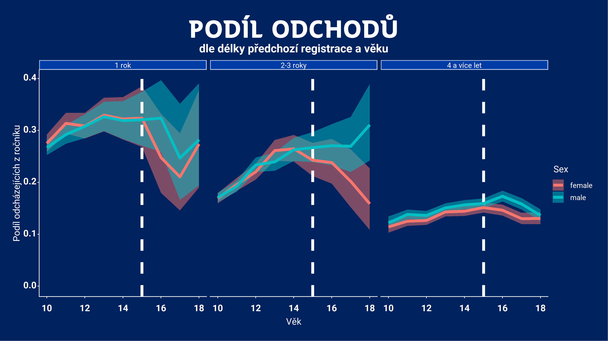

```{r setup, message=FALSE,warning=FALSE, results="hide", echo = FALSE}
source(here::here("R","setup_dotaznik.R"), encoding = "UTF-8")
knitr::opts_chunk$set(echo = FALSE)
```

- TODO: Dát všude do popisku pťesnou formulaci otázky (asi vymyslet, aby byla v grafů)
- TODO: Jsou roveři hozeni do vody? (asi rozházet po jednotlivých částech?)
- TODO: Vždy text a pak obrázek
- TODO: I ti, co odpověděli, že nikdy nebyli ve společenství si občas přivlastnili roverské role... Rozmyslet, co to znamená. (asi hlavně problém kvality dat) 
- TODO: číslovat sekce, ať je jasné, jak to sebe patří
- OTHER - jiné

```{r nacist_data, cache=TRUE}
source(here::here("R","datasety_dotaznik.R"), encoding = "UTF-8")

plots <- list() 
```

# Shrnutí závěrů

- Roveři jsou aktivní v organizaci...
- TODO


# Životní cyklus rovera

## Vstup do roverského věku

Jedním z často zmiňovaných problémů je, že na přelomu skautského a roverského věku "ztrácíme" členy. Tuto otázku jsme samostatně analyzovali v dokumentu "odchody_lidi", zde jen zopakujeme hlavní shrnutí 

> V datech z registrace za roky 2012-2018 lze v některých skupinách členů vidět mírný vzestup míry odchodů kolem 15tého roku věku. Nejsilnější takový nárust jsme pozorovali u chlapců, kteří jsou již členy Junáka alespoň 4 roky. Ve 12ti letech opouští organizaci v průměru 14% takovýchto chlapců z ročníku (tj. zhruba jeden ze sedmi), tato míra pak roste plynule až k 16ti letům, kdy jich odchází 17% z ročníku (tj. zhruba jeden z šesti). V jiných kategoriích je nárůst kolem přechodu do roverského věku nižší. V roverském věku pak míra odchodů klesá s rostoucím věkem klesá.

> Nízký počet roverů je pravděpodobně více ovlivněn výrazným poklesem přílivu nováčků s rostoucím věkem a celkově vysokým "odpadem" nováčků (až 33% prvně registrovaných se neregistruje podruhé) i zkušenějších členů (až 18% z ročníku) napříč skautským věkem.

To lze též shrnout obrázkem:

{width=70%}

_Zde vidíme, jaká část členské základny Junáka daného věku odešla během sledovaného období, rozděleno na nováčky (registrují se poprvé) a ostatní. Raději příklad: kdyby za roky 2012-2018 období bylo v Junáku celkem 1000 chlapců, kteří se poprvé registrovali během svých 13ti let a z toho se jich 200 již znovu neregistrovalo, bude v grafu 0.2. Pruh kolem údajů ukazuje očekávanou nejistotu/šum (čím méně lidí v kategorii, tím méně si jsme jisti, že to co vidíme je reprezentativní). Pozorovaný nárůst odchodů mužských členů s 2-3 letou zkušeností v roverském věku není příliš zásadní, protože absolutní počet těchto členů je nízký. _

```{r}
if(any(hlavni_data$let_v_junaku < hlavni_data$let_v_kmeni, na.rm = TRUE)) {
  stop("Nekdo byl dele v Junaku nez v kmeni")
}

data_vstupy <- hlavni_data %>% mutate(
  vek_vstupu_do_kmene = if_else(kategorie_respondenta_full == "nyni_spolecenstvi", age - let_v_kmeni, NA_real_),
  vek_vstupu_do_junaka = age - let_v_junaku)

podile_vstoupili_do_11ti_let <- mean(data_vstupy$vek_vstupu_do_junaka < 11, na.rm = TRUE)
```


Respondenti tomuto odpovídají - `r scales::percent(podile_vstoupili_do_11ti_let)` jich vstoupilo do Junáka když jim bylo méně než 11 let.

Bavíme-li se o vstupu do roverského společenství, málokdo vstupuje do kmene později než těsně po skautském věku.

```{r, fig.cap='Rozložení věku vstupu do kmene. Věk vstupu určen z otázek "Jak dlouho jsi ve společenství" a "Věk", proto lze určit jen u těch, kdo nyní jsou ve společenství.'}


plots$vek_vstupu_do_kmene <- data_vstupy %>% filter(!is.na(vek_vstupu_do_kmene)) %>%
  ggplot(aes(x = vek_vstupu_do_kmene)) + geom_histogram(binwidth = 1) + vodorovne_popisky_x + 
  scale_x_continuous(breaks = c(13, 15, 18, 21, 24)) +
  ggtitle("Věk vstupu do kmene\nJen členi společenství")

plots$vek_vstupu_do_kmene
```

### Čím si prošli

Vícekrát jsme se setkali s doměnkou, že nefunkční družinový systém je příčinou problémů roveringu. Slušné množství roverů přichází z oddílů, kde družinový systém aspoň trochu fungoval, takže se na to nemůžeme tolik vymlouvat (jakkoliv námi položené otázky nemohou odhalit, jestli družiny skutečně fungovaly dobře). Odpovědi našich respondentů čísla jsou ostatně velmi podobné výsledkům z nedávných sond o družinovém systému.

```{r}
plots$fungovani_skautskeho_oddilu <- plot_summary_mc(hlavni_data, fungovani_skautskeho_oddilu, "Moje družina ve skautském věku") 
plots$fungovani_skautskeho_oddilu
```

TODO: korelace problémů roveringu s odpovědmi o družinovém systému

Zároveň většina lidí, co v Junáku "přežije" do roverského věku tak byla již aktivní ve skautském věku (_pozn.: otázka se ptala, co zažili obecně, tudíž nelze vyloučit, že někteří byli rádci/podrádci či účastníci rádcovského kurzu až v roverském věku_).

```{r}
plots$zazil_radce <- hlavni_data %>% plot_summary_mc(co_zazil, "Co zažili ve skautingu", subtitle = "jen otázky k rádcování", include_values = c("radce_podradce", "radcovsky_kurz"))
plots$zazil_radce
```

### Vlastní vstup

Jak vypadá vlastní přechod do roverského věku? Tady je opět těžká interpretace: necelých 60% mělo snadný přechod. Je to úspěch nebo se máme rmoutit pro dva z pěti roverů, co to dle vlastního pocitu snadné neměli? Obdobně, když si zhruba polovina roverů myslí, že byla připravena se aspoň trochu podílet na přípravě programu rovesrkého společenství, je to hodně nebo málo?

Ptali jsme se též, jestli se roverem stanu "automaticky" když dovrším skautský věk - vypadá to, že zhruba v polovině středisek tento přechod automatický není a nejspíš se tedy rozlišuje mezi "roverem" a "členem v roverském věku".

```{r}
plots$vyroky_zazil_vstup <- plot_summary_mc(hlavni_data, vyroky_o_roveringu_zazil_2, "Rovering, který jsem zažil", subtitle = "jen otázky ke vstupu do roverského věku", include_values = c("rover_automaticky","vstupni_ritual","snadny_prechod", "pri_prechodu_schopny"))
plots$vyroky_zazil_vstup
```

Jedna z otázek RO byla, zde "automatický" přechod - znamená též přechod “bez rituálu”. To se nezdá jako pravděpodobné - naopak všechny čtyři kombinace těchto možností jsou celkem podobně zastoupeny, jakkoliv z "automatických" jich rituálem projde více.:

```{r}
hlavni_data %>% filter(!is.na(vyroky_o_roveringu_zazil_2)) %>%
  rename(rover_automaticky = vyroky_o_roveringu_zazil_2.rover_automaticky, vstupni_ritual = vyroky_o_roveringu_zazil_2.vstupni_ritual) %>%
  group_by(rover_automaticky, vstupni_ritual) %>%
  summarise(pocet = n()) %>%
  ungroup() %>%
  mutate(podil = scales::percent(pocet / sum(pocet)),
         rover_automaticky = if_else(rover_automaticky, "Ano", "Ne"),
         vstupni_ritual = if_else(vstupni_ritual, "Ano", "Ne"))
```

A co ti, co do společenství nikdy nevstoupili (ale již nejsou v oddíle mladších členů)? To je zhruba `r scales::percent(sum(hlavni_data$kategorie_respondenta_full == "nikdy_spolecenstvi_starsi") / nrow(hlavni_data))` respondentů.


### Pohled nečlenů

```{r}
podil_neroveru_bez_informaci <- mean(hlavni_data$vyroky_o_roveringu_stredisko.nevim, na.rm=TRUE)
```


Jen malá část lidí mimo společenství je tam, kde je funkční roverské společenství (a ví o něm). Naopak respondenti, kteří nebyli nikdy součástí společenství běžně uvádějí, že roveři v jejich středisku "Nemají definovanou úlohu".

Z lidí v roverském věku, kteří nikdy nebyli ve společenství jich `r scales::percent(podil_neroveru_bez_informaci)` označilo, že o roverech na středisku nemá informace. To je sice malé číslo, zároveň to je jedna z věcí, kde lze snáze něco změnit.

```{r}
plots$vyroky_o_roveringu_stredisko_informace <- plot_summary_mc(hlavni_data, vyroky_o_roveringu_stredisko, "O roverech v mém středisku platí", subtitle = "(jen ti, co již nejsou v mladším oddíle a nikdy nebyli ve společenství)", include_values = c("je_spolecenstvi","pravidelne","bez_ulohy", "vlastni_akce", "nejsou", "nevim"))
plots$vyroky_o_roveringu_stredisko_informace


```

V otázkách výše je taky vidět, že "mít vlastní akce" je (z pohledu lidí, co se na společenství dívají z vnějšku) o dost snažší naplnit než "funkční společenství". 


## Život v kmeni

Asi nepřekvapí, že většina kmenů je malá a jen kolem pětiny roverů je ve společenstvích s více jak 20 členy. Zajímavé ale může být, že mikro společenství (do 5 členů) je jen minimum. Ač zde je možné, že někteří respondenti v malých společenství uvedli, že v žádném společenství nejsou.


```{r}
plots$pocet_clenu_spolecenstvi <- plot_summary_mc(hlavni_data, pocet_clenu_spolecenstvi, order_by_podil = FALSE, invert_color_threshold =  0.03)
plots$pocet_clenu_spolecenstvi

```

### Frekvence akcí

Ptali jsme se též na frekvenci akcí, ale jen současných členů (nevěřili jsme, že bývalí si to budou dobře pamatovat). Hrubá čísla asi nepřekvapí - většina roverů má tu a tam nějakou akci, velmi aktivních i zcela neaktivních kmenů je málo.

```{r}
if(sum(hlavni_data$frekvence_kratkych_akci < "mesicne", na.rm = TRUE) !=
   sum(hlavni_data$frekvence_kratkych_akci %in% c("nevyplneno", "nikdy","rocne","nekolik_rocne"), na.rm = TRUE)) {
  stop("Neplatny ordering")
}

```

```{r}
plots$frekvence_kratkych_akci <- plot_summary_mc(hlavni_data, frekvence_kratkych_akci, "Frekvence kratších akcí", order_by_podil = FALSE, invert_color_threshold = 0.03)
plots$frekvence_kratkych_akci

```

```{r}
plots$frekvence_vicedennich_akci <- plot_summary_mc(hlavni_data, frekvence_vicedennich_akci, "Frekvence vícedenních akcí", order_by_podil = FALSE, invert_color_threshold = 0.03)
plots$frekvence_vicedennich_akci

```
```{r}
plots$frekvence_velkych_akci <- plot_summary_mc(hlavni_data, frekvence_velkych_akci, "Frekvence velkých akcí", order_by_podil = FALSE)
plots$frekvence_velkych_akci

```


Nabízí se otázka, jak časté jsou kmeny, které mají např. málo vícedenních akcí, ale pravidelně jezdí na expedice. Nebo mají hodně krátkých akcí, ale téěmř žádné větší. To se zdá jako obojí dosti vzácné, frekvence různých druhů akcí spolu celkem dobře koreluje. Následující obrázky ukazují jak časté jsou různé kombinace frekvencí krátkých, delších a velkých akcí (čím tmavší tím častější, barva pozadí znemaná, že tuto kombinaci nikdo nevyplnil). Vidíme, že "tmavé oblasti"  jsou tam, kde je buď málo všech druhů akcí nebo celkem dost všech druhů akcí.

```{r}
hlavni_data %>% 
  filter(frekvence_kratkych_akci != explicit_na_level) %>%
  group_by(frekvence_kratkych_akci, frekvence_vicedennich_akci) %>%
  summarise(pocet = n()) %>%
  group_by(frekvence_kratkych_akci) %>%
  mutate(podil_vicedennich = pocet / sum(pocet)) %>%
  ggplot(aes(x = frekvence_kratkych_akci, y = frekvence_vicedennich_akci, fill = podil_vicedennich)) + 
  geom_raster() + scale_x_discrete() + scale_y_discrete() + scale_fill_revize(discrete = FALSE)

hlavni_data %>%
  filter(frekvence_kratkych_akci != explicit_na_level) %>%
  group_by(frekvence_velkych_akci, frekvence_vicedennich_akci) %>%
  summarise(pocet = n()) %>%
  group_by(frekvence_vicedennich_akci) %>%
  mutate(podil_velkych = pocet / sum(pocet)) %>%
  ggplot(aes(x = frekvence_vicedennich_akci, y = frekvence_velkych_akci, fill = podil_velkych)) +
  geom_raster() + scale_x_discrete() + scale_y_discrete() + scale_fill_revize(discrete = FALSE)

```

### Pohled nečlenů

Jak jsou aktivní roveři pohledem roverů mimo společenství? Zhruba třetina roverů, co nikdy nebyli ve společenství uvádí, že roveři v jejich středisku mají vlastní roverské akce - což je výrazně více než zhruba 1/8 která uvádí, že na středisku je funkční společenství nebo že se roveři nějak pravidelně scházejí.

```{r}
plots$vyroky_o_roveringu_stredisko_aktivita <- plot_summary_mc(hlavni_data, vyroky_o_roveringu_stredisko, "O roverech v mém středisku platí", subtitle = "(jen ti, co již nejsou v mladším oddíle a nikdy nebyli ve společenství)", include_values = c("je_spolecenstvi","pravidelne","vlastni_akce", "rozviji_se"))
plots$vyroky_o_roveringu_stredisko_aktivita
```


### Jak roversky žijí rádci?

Dotaz od Ifanky: Jak jsou na tom rádci u oddílů / u družin s aktivitou (jde mi asi hlavně o ty mladší) - jak často jezdí na akce, vzdělávačky, jednoduše jak jsou aktivní?

Podívali jsme se tedy na respondenty do 18ti let včetně a porovnali ty, kdo zaškrtli "Oddílový rádce" nebo "Družinový rádce" jako jednu ze svých rolí. Ve frekvenci akcí nebo tom, jaké kurzy zažili se nezdá velký rozdíl od "zbytku populace". 


```{r}
data_mladsi_radce <- hlavni_data %>% filter(age <= 18) %>% mutate(mladsi_radce = if_else(age <= 18 & (role_skauting.oddilovy_radce | role_skauting.druzinovy_radce), "Ano", "Ne")) 

data_mladsi_radce %>%
  plot_frekvence_by("frekvence_kratkych_akci", mladsi_radce)
                                              
data_mladsi_radce %>%
  plot_frekvence_by("frekvence_vicedennich_akci", mladsi_radce)

data_mladsi_radce %>%
  plot_frekvence_by("frekvence_velkych_akci", mladsi_radce)

  # plot_summary_mc(frekvence_kratkych_akci, "Frekvence krátkých akcí", subtitle = "Jen do 20ti let, oddíloví, družinoví rádci" , order_by_podil = FALSE)

# hlavni_data %>% filter(age < 20, role_skauting.oddilovy_radce | role_skauting.druzinovy_radce) %>%
#   plot_summary_mc(frekvence_vicedennich_akci, "Frekvence vícedenních akcí", subtitle = "Jen do 20ti let, oddíloví, družinoví rádci" , order_by_podil = FALSE)

```

```{r, fig.cap='spolecenstvi_kurzy_akce se vztahuje k oblasti "Označ všechny výroky, které platí o roveringu, který jsi sám zažil" a otázce "Jezdíme na skautské kurzy a/nebo celostátní akce.". Ostatní hodnoty se týkají oblasti "Co jsi v Junáku zažil/absolvoval?" '}
data_mladsi_radce %>% rename(co_zazil.spolecenstvi_kurzy_akce = vyroky_o_roveringu_zazil.kurzy_akce) %>% plot_binarni_s_nejistotou(c( "co_zazil.spolecenstvi_kurzy_akce", "co_zazil.cekatelky", "co_zazil.roversky_kurz", "co_zazil.vudcovky", "co_zazil.jiny_kurz"), by = mladsi_radce, names_prefix = "co_zazil.", flip = TRUE, legend_label = "Je mladší rádce", na.rm = TRUE)
```


## Nástroje roverského programu

```{r}
klicove_nastroje_id <- c("vyzvy", "projekty", "zacatek", "kurzy", "odborky", "putovani", "zahranici", "stezky", "velke_akce")

klicove_nastroje_text <- names(popisky_voleb(hlavni_data, vychovne_nastroje)[popisky_voleb(hlavni_data, vychovne_nastroje) %in% klicove_nastroje_id])

data_klicove_nastroje <- hlavni_data %>% 
  filter(!is.na(vychovne_nastroje)) %>%
  mutate(pocet_klicovych_nastroju = vychovne_nastroje.vyzvy + vychovne_nastroje.projekty + vychovne_nastroje.zacatek + vychovne_nastroje.kurzy + vychovne_nastroje.odborky + vychovne_nastroje.putovani + vychovne_nastroje.zahranici + vychovne_nastroje.vlastni_stezky + vychovne_nastroje.velke_akce) 

data_klicove_nastroje_shrnuto <- data_klicove_nastroje %>% 
  group_by(pocet_klicovych_nastroju) %>%
  summarise(pocet = n()) %>%
  ungroup() %>%
  mutate(podil = pocet / sum(pocet))

podil_kmen_max_3_nastroje <- sum(
  data_klicove_nastroje_shrnuto %>% filter(pocet_klicovych_nastroju <= 3) %>% pull(podil))
podil_kmen_min_5_nastroju <- sum(
  data_klicove_nastroje_shrnuto %>% filter(pocet_klicovych_nastroju >= 5) %>% pull(podil))

pocet_kmen_8_nastroju <- data_klicove_nastroje_shrnuto %>% filter(pocet_klicovych_nastroju == 8) %>% pull(pocet)
pocet_respondentu_nastroje <- sum(!is.na(hlavni_data$vychovne_nastroje))
```


Respondentům jsme dali na výběr širokou paletu možných nástrojů roverského programu a měli označit, které se používají u nich ve společenství. Devět z těchto nástrojů jsme si označili za klíčové: `r paste0(klicove_nastroje_text, collapse=", ")`. Všimněte si, že pojmenování je spíše širší než užší, tj. pod "Výzvu" nebo "Projekt" se vejde ledacos, "Velké roverské akce" si nemuseli všichni vyložit jako "Obrok a spol." a mohli do toho třeba zahrnout expedice apod. (což je problém který jsme si uvědomili až při vyhodnocování dotazníku). 

Přes široké pojetí, `r scales::percent(podil_kmen_max_3_nastroje, accuracy = 2)` respondentů je v kmeni, který použivá jen tři nebo méně z těchto nástrojů a jen `r scales::percent(podil_kmen_min_5_nastroju, accuracy = 2)` jich používá více jak polovinu. Z `r pocet_respondentu_nastroje` respondentů, kteří na otázku odpovídali, jen `r pocet_kmen_8_nastroju` respondenti zaškrtli osm z klíčových nástrojů a všech devět nezaškrtl nikdo.

```{r}
plots$klicove_nastroje <- data_klicove_nastroje_shrnuto %>%
  ggplot(aes(x = pocet_klicovych_nastroju, y = podil)) + geom_bar(stat = "identity") + vodorovne_popisky_x + plot_annotation("Počet klíčových výchovných nástrojů", subtitle = "9 nástrojů (vyzvy, projekty, zacatek, kurzy, odborky, putovani, zahranici, stezky, velke akce)") + scale_y_continuous("Podíl", labels = scales::percent)

plots$klicove_nastroje
```

Nijak asi nepřekvapí, že počet užitých nástrojů je vyšší u kmenů aktivních i v dalších měřítkách (například dle frekvence akcí nebo vyššího počtu členů), ač ani mezi nejaktivnějšími kmeny se příliš mnoho nástrojů nepoužívá.

```{r}
data_klicove_nastroje %>% plot_ciselne_s_nejistotou("pocet_klicovych_nastroju", by = frekvence_vicedennich_akci)


data_klicove_nastroje %>% plot_ciselne_s_nejistotou("pocet_klicovych_nastroju", by = pocet_clenu_spolecenstvi)

```

```{r}
podil_nepouziva_nic <- mean(hlavni_data$vychovne_nastroje.nic, na.rm = TRUE)
podil_pouziva_projekty <- hlavni_data %>% 
  summarise(podil = mean(vychovne_nastroje.projekty, na.rm = TRUE)) %>% pull(podil)
podil_pouziva_projekty_vyzvy <- hlavni_data %>% 
  summarise(podil = mean(vychovne_nastroje.vyzvy & vychovne_nastroje.projekty, na.rm = TRUE)) %>% pull(podil)
  
```

Podíváme-li se, které konkrétní nástrojů jsou nejzastoupenější, jde o velké akce, výzvy, časopis kmen, projekty a putování. Hodně roverů (`r scales::percent(podil_nepouziva_nic)`) je z kmenů, které nepoužívají vůbec žádné výchovné nástroje. Přestože nezanedbatelná část roverů je v kmenech, kde se používají výzvy nebo projekty, jen `r scales::percent(podil_pouziva_projekty_vyzvy)` jich používá obojí. A to za podmínek, kdy položená otázka nedávala na obsah projektů/výzev téměř žádná omezení a jako nástroj je to tedy spíše vágní. Roverský začátek jako jeden z mála zcela konkrétních výstupů roverského programu používá jen hodně málo roverů.

```{r}
plots$vychovne_nastroje <- plot_summary_mc(hlavni_data, vychovne_nastroje, "Používáme tyto výchovné nástroje")
plots$vychovne_nastroje
```


Celkově si tedy myslíme, že roverský program v podstatě není téměř nikde plně zaveden, naopak ve většině kmenů jsou z něj užity jen drobky.

```{r}
#TODO: Porovnat s průzkumem na Obroku!
#TODO: Proč není zaveden? 

```


```{r}
podil_roversky_program_pomaha <- mean(hlavni_data$co_pomaha_roveringu.roversky_program, na.rm=TRUE)
```

Jen `r scales::percent(podil_roversky_program_pomaha)` respondentů uvedlo, že dle jejich zkušenosti "Roverský program vydaný Junákem" roveringu "znatelně pomáhá".

Tím, že míra zavedení (ve smyslu počtu používaných nástrojů) dost koreluje s jinými měřítky aktivity, je nepravděpodobné, že by se zde podařilo oddělit příčinu a následek, jakkoliv je určitě ještě možné se pokusit o detailnější analýzu. 

```{r}
#TODO: subset, kde je zaveden, pomáhá?
#TODO: Přispívá RSP k nějakým problémům roveringu?
#TODO: Může RSP v principu fungovat navzdory problémům roveringu?
```


### Muži a ženy 

Musíme velmi opatrně, protože muži ve vzorku jsou celkově starší než ženy.

```{r}
# Korelace rozdílů v mužsko-ženských použití nástrojů a spokojenosti ve společenství, tj. Je něco co “cpeme holkám”? 
# TODO: rozdíly v pohlaví A ve spokojenosti - trošku komplikované, zatím odkládám.
```

V první řadě se můžeme podívat, jak se liší použití nástrojů mezi pohlavími - existuje pár nástrojů, kde je rozdíl v užití mezi pohlavími, ale jedná se spíše o ty okrajové (wiki používají muži zhruba 3x častěji než ženy, naopak RoverNet používají ženy 2x častěji a diář ženy zhruba 1.5x častěji).

```{r}
data_nastroje_pohlavi <- hlavni_data %>%
  filter(!is.na(vychovne_nastroje)) %>%
  pivot_longer(starts_with("vychovne_nastroje."), names_prefix = "vychovne_nastroje.", names_to = "nastroj",
                values_to = "pouziva") %>%
  group_by(nastroj) %>%
  summarise(
    vice_u_muzu_absolutne = mean(pouziva[sex == "muz"]) - mean(pouziva[sex == "zena"]),
    vice_u_muzu_relativne = mean(pouziva[sex == "muz"]) / mean(pouziva[sex == "zena"])
    ) %>%
  ungroup()

plots$nastroje_rozdil_pohlavi_relativne <- data_nastroje_pohlavi %>%
  mutate(nastroj = fct_reorder(nastroj, vice_u_muzu_relativne)) %>%
  ggplot(aes(x = nastroj, y = vice_u_muzu_relativne)) + geom_bar(stat = "identity") + scale_y_log10("", breaks = c(0.5, 2/3,1,1.5,2), labels = c("Ženy 2x častěji", "Ženy 1.5x častěji", "Stejně", "Muži 1.5x častěji", "Muži 2x častěji")) + plot_annotation("Využívání nastrojů rovery a rangers", "Relativní rozdíl")

plots$nastroje_rozdil_pohlavi_relativne
```
Můžeme se též podívat na absolutní čísla (tj. o kolik procentních bodů se podíl uživatelů liší mezi muži a ženami) - výsledky jsou podobné, ale relativně nízké absolutní hodnoty potvrzují, že velké relativní rozdíly jsou hlavně u nástrojů, které nejsou celkově příliš používané. Naopak s výjimkou kurzů jsou mezi zásadními nástroji jen malé rozdíly. 

```{r}
plots$nastroje_rozdil_pohlavi_absolutne <- data_nastroje_pohlavi %>%
  mutate(nastroj = fct_reorder(nastroj, vice_u_muzu_absolutne)) %>%
  ggplot(aes(x = nastroj, y = vice_u_muzu_absolutne)) + geom_bar(stat = "identity") + scale_y_continuous("Podíl muži - podíl ženy", labels = scales::percent) + plot_annotation("Využívání nastrojů rovery a rangers", "Absolutní rozdíl")

plots$nastroje_rozdil_pohlavi_absolutne

```

Potvrzuje se  zkušenost z kurzů, že na ně častěji jezdí ženy - a zde vidíme, že to nelze snadno svést na rozdílné počty roverů a rangers - společenství, kde jsou ženy, využívají roverské kurzy častěji.


### Kurzy

Na kurzy se taky můžeme podívat přes otázku, co sami respondenti (tedy ne jejich společenství) zažili:

```{r}
plots$co_zazil_kurzy <- hlavni_data %>% plot_summary_mc(co_zazil, "Co zažili ve skautingu", exclude_values = c("radce_podradce", "radcovsky_kurz", "__nic"))
plots$co_zazil_kurzy

aspon_jeden_kurz <- mean(hlavni_data$co_zazil %contains_any_word% c("cekatelky","vudcovky","roversky_kurz", "jiny_kurz"), na.rm = TRUE)
```


Obecně vidíme, že méně lidí zažilo roverský kurz, než kolik říká, že jejich společenství využívá kurzy jako nástroj (TODO zopakovat číslo). Na kurzy - zejména čekatelky - se hodně jezdí (tedy ve vzorku roverů, který máme). Celých `r scales::percent(aspon_jeden_kurz)` respondentů bylo aspoň na jednom z kurzů zmíněných výše.

Počet účastníků kurzů samozřejmě roste s věkem respondentů, takže mezi těmi, co vydží do cca 20 let už má čekatelky za sebou kolem 80% a procento složených vůdcovek je u starších také dosti vysoké.

```{r}
hlavni_data %>% filter(!is.na(co_zazil)) %>% plot_binarni_s_nejistotou(paste0("co_zazil.", c("cekatelky","vudcovky","roversky_kurz", "jiny_kurz")), names_prefix = "co_zazil.", by = age) +  plot_annotation(title = "Kurzy, co zažili, dle věku")
```

Obecně se tedy dá očekávat, že kurzy jsou dobrým místem, kde lidé v roverském věku mohou být vystaveni myšlenkám roveringu - jen málo lidí v roverském věku je kurzy zcela netknuto.


V našem vzorku též vyšlo, že ženy o něco častěji uvádějí, že zažily roverské kurzy, ale po zohlednění rozdílů ve věku se rozdíl nezdá přesvědčivý (data zde neukazujeme).


### Dotaz RO: Čekali bychom, že velké akce jsou důležité pro společenství, co není moc organizované, ale data to možná nepotvrzují.

To můžeme asi posoudit jen z toho, jak velká část takových společenství velké akce využívá. Kmeny s organizací (tahoun, rada, vudce) nebo jen ty, co mají vůdce jezdí na velké akce spíše častěji než ty méně organizované, jakkoliv rozdíl je menší než šum. Jak moc jsou velké akce "důležité" z toho samozřejmě zjistit nemůžeme. 

```{r}
plot_velke_akce_organizovan <- hlavni_data %>% plot_binarni_s_nejistotou("vychovne_nastroje.velke_akce", je_organizovan, na.rm = TRUE)

plot_velke_akce_vudce <- hlavni_data %>% plot_binarni_s_nejistotou("vychovne_nastroje.velke_akce", ma_vudce, na.rm = TRUE)

plot_velke_akce_organizovan + plot_velke_akce_vudce + plot_annotation("Podíl kmenů užívajících velké akce", "dle různých měřítek organizace")
```

## Spokojenost roverů


```{r}
plots$spokojenost_rs <- hlavni_data %>% plot_summary_mc(spokojenost_clenstvim_v_rs, "Spokojenost s členstvím ve společenství")
plots$spokojenost_rs

# TODO: životní spokojenost!
```

Vztahy mezi rovery jsou jednoznačně věc, se kterou jsou roveři nejčastěji spokojeni a nejméně často nespokojeni.  Naopak je mnohem více roverů nespokojeno s četností akcí než je s ní spokojeno a ani polovina roverů není spokojena s náplní programu.

```{r, fig.cap='Kombinuje otázky "Označ vše, s čím jsi (byl) ve svém roverském společenství SPOKOJEN" a "Označ vše, s čím jsi (byl) ve svém roverském společenství NESPOKOJEN" - pokud na obojí padla stejná odpověď, je to uvedeno jako "Smíšené" '}
data_s_cim_spokojen <- hlavni_data %>% filter(!is.na(s_cim_spokojen), !is.na(s_cim_nespokojen)) %>% select(starts_with("s_cim_spokojen"), starts_with("s_cim_nespokojen"))
spokojen_labels <- attributes(hlavni_data$s_cim_spokojen)$labels
for(l in spokojen_labels) {
  spokojen <- data_s_cim_spokojen[[paste0("s_cim_spokojen.",l)]]  
  nespokojen <- data_s_cim_spokojen[[paste0("s_cim_nespokojen.",l)]]  
  data_s_cim_spokojen[[paste0("spokojen_combined.",l)]] <- 
    case_when(spokojen & !nespokojen ~ "spokojen",
              nespokojen & !spokojen ~ "nespokojen",
              TRUE ~ "smisene"
              )
}

labels_spokojen <- popisky_voleb(hlavni_data, s_cim_spokojen)

data_s_cim_spokojen %>% 
  pivot_longer(starts_with("spokojen_combined"),                                                               names_prefix = "spokojen_combined.", names_to = "kategorie", values_to = "spokojen") %>% 
  group_by(kategorie, spokojen) %>% 
  summarise(pocet = n()) %>%
  group_by(kategorie) %>% 
  mutate(podil = pocet / sum(pocet), 
         spokojen = factor(spokojen, levels = c("nespokojen","smisene", "spokojen")),
         y_text = case_when(spokojen == "spokojen" ~ 0.08,
                            spokojen == "nespokojen" ~ 0.92,
                            TRUE ~ 0.5),
         text = if_else(spokojen == "smisene", "", scales::percent(podil, accuracy = 1)),
         nazev_kategorie = factor(kategorie, levels = labels_spokojen, labels = names(labels_spokojen))
         ) %>%
  
  ggplot(aes(x = nazev_kategorie, y = podil, fill = spokojen)) + geom_bar(stat = "identity") +
  geom_text(aes(x = nazev_kategorie, y = y_text, color = spokojen, label = text), family = title_family(), size = 6) +
  coord_flip() + discrete_scale("fill", "revize_test",palette = revize_pal(palette = "continuous")) + discrete_scale("color", "revize_test",palette = revize_pal(palette = "continuous", reverse = TRUE)) + guides(color = FALSE) + 
  theme(axis.text.x = element_blank(), axis.title.x = element_blank()) +
  plot_annotation("S čím jsi ve společenství (ne)spokojen ")

# plots$s_cim_spokojen <- plot_summary_mc(hlavni_data, s_cim_spokojen, title = "S čím jsi ve společenství spokojen", exclude_values = "postoj_strediska")
# plots$s_cim_spokojen
# 
# 
# 
# plots$s_cim_nespokojen <- plot_summary_mc(hlavni_data, s_cim_nespokojen, title = "S čím jsi ve společenství NEspokojen", exclude_values = "postoj_strediska") 
# plots$s_cim_nespokojen

```

Pro spokojenost s frekvencí akcí je tu jistý klesající trend s věkem - velké výkyvy u starších roverů je třeba brát s rezervou, protože to je malý vzorek (křivka pro "nespokejen s četností akcí" je vlastně jen inverzní)

```{r}
# , fig.cap="Bereme zde jen současné členy, protože u bývalých členů není jasné, jak dlouho jsou již mimo společenství."

plots$spokojenost_frekvence_akci_vek <- hlavni_data %>% 
  filter(kategorie_respondenta == "nyni_spolecenstvi") %>%
  plot_binarni_s_nejistotou(c("s_cim_spokojen.cetnost_akci"), age, na.rm = TRUE) + plot_annotation("Spokojen s frekvencí akcí dle věku", "Jen současní členové")

plots$spokojenost_frekvence_akci_vek
```

Intuitivně asi čekáme, že většina nespokojených je nespokojena, protože akcí je málo a jen málo proto, že akcí je moc. Přímo jsme se na toto dělení neptali, ale můžeme to zodpovědět nepřímo tak, že se podíváme, jestli ti spokojení mají obecně více akcí.

A skutečně, čím více akcí (jakéhokoliv druhu), tím spokojenější s frekvencí akcí. Nicméně zhruba čtvrtina současných roverů je spokojená s četností "nikdy".

```{r}
plots$spokojenost_frekvence_akci_kratke_akce <- hlavni_data %>%
  filter(kategorie_respondenta == "nyni_spolecenstvi") %>%
  plot_binarni_s_nejistotou("s_cim_spokojen.cetnost_akci", frekvence_kratkych_akci, na.rm = TRUE) + plot_annotation("Spokojen s frekvencí akcí dle frekvence", "Krátké akce")
plots$spokojenost_frekvence_akci_kratke_akce  
```

Frekvence různých druhů akcí spolu dost korelují, takže grafy pro vícedenní a větší akce vypadají velmi podobně.


Trend s věkem je též vidět u spokojenosti s náplní programu, ač zde dosahuje minima kolem 20tého roku věku. Možná čistě proto, že nespokojení starší členové již ve společenství nejsou.

```{r, fig.cap="Bereme zde jen současné členy, protože u bývalých členů není jasné, jak dlouho jsou již mimo společenství."}
hlavni_data %>% 
  filter(kategorie_respondenta == "nyni_spolecenstvi") %>%
  plot_binarni_s_nejistotou(c("s_cim_spokojen.program"), age, na.rm = TRUE) + plot_annotation("Spokojen s náplní programu dle věku", "Jen současní členové")
```

## Stárnutí rovera

```{r}
podil_vic_jak_3_roky_v_kmeni <- hlavni_data %>% filter(!is.na(let_v_kmeni))  %>% summarise(podil = mean(let_v_kmeni > 3)) %>% pull(podil)

podil_vic_jak_3_roky_v_kmeni_dokoncene <- hlavni_data %>% filter(!is.na(let_v_kmeni), kategorie_respondenta == "drive_spolecenstvi")  %>% summarise(podil = mean(let_v_kmeni > 3)) %>% pull(podil)

```


Jen `r scales::percent(podil_vic_jak_3_roky_v_kmeni)` respondentů strávilo ve svém kmeni více jak tři roky. To je samozřejme trochu pesimistické, protože část roverů ještě v kmeni je a nějaké roky ještě dožene. 

```{r, fig.cap='Otázka: "Kolik celých let jsi strávila v roverském společenství?" - současní i bývalí členové.'}
plots$roky_ve_spolecenstvi <- hlavni_data %>% filter(!is.na(let_v_kmeni)) %>% ggplot(aes( x = let_v_kmeni)) + geom_histogram(binwidth = 1) + ggtitle("Počet let ve společenství") + scale_x_continuous("Let ve společenství") + scale_y_continuous("Počet") + vodorovne_popisky_x 
plots$roky_ve_spolecenstvi
```


```{r}
# TODO censored model pro dobu ve společenství.

# data_let_v_kmeni_censored <- hlavni_data %>% filter(kategorie_respondenta_full %in% c("nyni_spolecenstvi", "drive_spolecenstvi"), !is.na(let_v_kmeni)) %>%
#   mutate(is_censored = kategorie_respondenta_full == "nyni_spolecenstvi")
# fit_let_v_kmeni <- brm_with_cache(let_v_kmeni | cens(is_censored) ~ 1, family = brms::brmsfamily("negbinomial"), data = data_let_v_kmeni_censored, cache_file = here("local_data","fits", "let_v_kmeni.rds"))
# summary(fit_let_v_kmeni)
# 
# brms::pp_check(fit_let_v_kmeni, "bars", newdata = data_let_v_kmeni_censored %>% filter(!is_censored))
# 
# let_v_kmeni_pred <- brms::posterior_predict(fit_let_v_kmeni, new_data = dat.frame(is_censored = FALSE))
# 
# podil_vic_jak_3_roky_v_kmeni_model <- mean(let_v_kmeni_pred > 3)
# 
# prumer_let_v_kmeni_model <- mean(let_v_kmeni_pred)
```


Celkem nepřekvapivě klesá aktivita kmenů s věkem jejich členů:

```{r, fig.cap = 'Pro zařazení do "Aktivní-základ" musí být buď frekvence krátkých akcí častější než měsíčně NEBO několikrát ročně krátké a vícedenní akce NEBO aspoň jednou ročně velká akce a nějaké kratší nebo vícedenní akce. Pro zařazení do "Aktivní-velmi" musí být uvedena alespoň jednou ročně velká akce A ZÁROVEŇ alespoň několik vícedenních akcí ročně A ZÁROVEŇ alespoň jednou měsíčně krátké akce.'}
plots$aktivita_vek <- hlavni_data %>% 
  filter(kategorie_respondenta_full == "nyni_spolecenstvi") %>%
  plot_binarni_s_nejistotou(c("kmen_aktivni_zaklad","kmen_aktivni_velmi"), age, names_prefix = "kmen_", na.rm = TRUE) +
  plot_annotation("Aktivita (frekvence akcí) - věk\nJen současní členové") + scale_x_continuous("Věk")
           
plots$aktivita_vek

```

Otázkou je, jestli je to spíše věkem členů nebo délkou trvání kmene. Délku existence kmene nemáme, ale můžeme se podívat na počet let v kmeni. Trend je výraznější u věku, takže bych spíš vsadil na věk. Nedá se to ale dobře rozlišit, protože to spolu hodně koreluje.


```{r}
plots$aktivita_let_v_kmeni <- hlavni_data %>% 
  filter(kategorie_respondenta_full == "nyni_spolecenstvi", let_v_kmeni < 8) %>%
  plot_binarni_s_nejistotou(c("kmen_aktivni_zaklad","kmen_aktivni_velmi"), let_v_kmeni, names_prefix = "kmen_") +
  plot_annotation("Aktivita (frekvence akcí) - let v kmeni\nJen současní členové")
           
plots$aktivita_let_v_kmeni
```


Spokojenost s členstvím _velmi mírně_ klesá s věkem, těžko z toho dělat silné závěry, protože, jak jsme viděli výše, s věkem klesá frekvence akcí a frekvence akcí taky koreluje se spokojeností, takže velká otázka, co je zde příčinou a následkem.

```{r}
hlavni_data %>% filter(kategorie_respondenta_full == "nyni_spolecenstvi") %>%
  mutate(spise_spokojen = spokojenost_clenstvim_v_rs > 4, naprosto_spokojen = spokojenost_clenstvim_v_rs > 6) %>%
  plot_binarni_s_nejistotou(c("spise_spokojen","naprosto_spokojen"), age) + scale_x_continuous("Věk") + plot_annotation("Spokojen s členstvím v RS - Věk\nJen současní členové")
  
```


## Odchod ze společenství

```{r}
podil_jen_zaniklo_nefungovalo <- hlavni_data %>% summarise(podil = mean(proc_neni_rover == "zaniklo_nefungovalo", na.rm = TRUE)) %>% pull(podil)
```


Nejvíc se ochází proto, že společenství zanikne nebo nefunguje. Špatné mezilidské vztahy jsou naopak méně běžnou příčinou.


```{r}
plots$proc_neni_rover <- plot_summary_mc(hlavni_data, proc_neni_rover, "Proč už nejsem v roverském společenství")
plots$proc_neni_rover

#zaniklo_nefungovalo_jediny_duvod


```

Málokdy (`r scales::percent(podil_jen_zaniklo_nefungovalo)`  je ale zánik/nefunkčnost uveden jako jediný důvod - většinou se k němu přidávají další osobní důvody.

```{r}
plots$proc_neni_rover_zaniklo <- 
  hlavni_data %>% filter(proc_neni_rover.zaniklo_nefungovalo) %>%  plot_summary_mc(proc_neni_rover, "Proč už nejsem v roverském společenství", max_podil = 0.99, subtitle = "Jen ti, co odpověděli, že společenství zaniklo/nefungovalo")
plots$proc_neni_rover_zaniklo


```

Podobné výsledky nám dá, když se podíváme na to, co vidí respondenti jako hlavní problémy roveringu.

```{r}
plots$problemy_cleni_ukonceni <- hlavni_data %>% plot_summary_mc(problemy_roveringu, "Hlavní problémy roveringu \n jen členi společenství", include_values = c("vytizeni_oddily","odstehovani","vytizeni_mimo", "nevidi_smysl", "spatne_vztahy"))

plots$problemy_cleni_ukonceni
podil_odstehovani <- mean(hlavni_data$problemy_roveringu.odstehovani, na.rm = TRUE)
```


```{r}
plots$vek_kategorie <-  hlavni_data %>% 
  mutate(`Je ve spolecenstvi` = kategorie_respondenta == "nyni_spolecenstvi", `Byl ve spolecenstvi` = kategorie_respondenta == "drive_spolecenstvi", `Nikdy nebyl` = kategorie_respondenta == "nikdy_spolecenstvi") %>%
  plot_binarni_s_nejistotou(c("Je ve spolecenstvi","Byl ve spolecenstvi", "Nikdy nebyl"), age, legend_label = "") +
  scale_x_continuous("Věk")+ plot_annotation("Věkové rozložení dle kategorie")

plots$vek_kategorie
```

Výše mimochodem další důvod si myslet, že lidi nevstupují do společenství po 16tém roku, jinak by čára "Nikdy nebyl" musela jít dolů v čase. Na druhou stranu až na hraně roverského věku máme více lidí co nejsou, než co jsou (ale to může být problém našeho průzkumu).

TODO: Problémy - jak se změnilo mezi lidmi, co “byli” a “jsou”

# Vedení a forma společenství

Nejprve hrubý přehled. Všimněme si, že rada kmene je poměrně málo zastoupená, zatímce různé formy neformálního (či žádného) vedení jsou zastoupeny poměrně bohatě.

```{r}
plots$organizace_spolecenstvi <- plot_summary_mc(hlavni_data, organizace_spolecenstvi, title = "Organizace kmene")
plots$organizace_spolecenstvi
```

Taky se vyskytují skoro všechny možné kombinace vedení:

```{r}
plots$organizace_spolecenstvi_kombinace <- 
  hlavni_data %>% select(organizace_spolecenstvi) %>%
    filter(!is.na(organizace_spolecenstvi)) %>%
    crossing(organizace_a =  popisky_voleb(hlavni_data, organizace_spolecenstvi)) %>%
    crossing(organizace_b =  popisky_voleb(hlavni_data, organizace_spolecenstvi)) %>%
    mutate(oboji = organizace_spolecenstvi %contains_word% organizace_a & organizace_spolecenstvi %contains_word% organizace_b) %>%
    group_by(organizace_a, organizace_b) %>%
    summarise(podil_radek = sum(oboji) / sum(organizace_spolecenstvi %contains_word% organizace_b)) %>%
    ungroup() %>%
    filter(organizace_a != organizace_b) %>%
    ggplot(aes(x = organizace_a, y = organizace_b, fill = podil_radek)) + geom_raster() + scale_fill_revize(name ="Podíl z řádku", discrete = FALSE, labels = scales::percent) +
    scale_y_discrete("Ti, co mají ... ") +
    scale_x_discrete("... mají zároveň též") +
    plot_annotation("Kombinace organizace kmene")

plots$organizace_spolecenstvi_kombinace
```

Na obrázku je v každém políčku znázorněno, kolik respondentů, kteří označili formu organizace v daném řádku vybralo též formu organizace ve sloupci. Vidíme tedy například, že přes polovinu kmenů, které mají formální radu určenou zhůry (oddíl/středisko) má i formálního vedoucího zhůry, zatímco z kmenů co mají vůdce zhůry (kterých je hodně) má navíc formální radu jen poměrně malé procento. Nebo také vidíme  

Hlavní ale zůstává, že velké množství kombinací je nějak zastoupeno.


```{r}
plots$role_roverske <- hlavni_data %>% filter(kategorie_respondenta != "nikdy_spolecenstvi") %>% plot_summary_mc(role_skauting, "Role ve skautingu", subtitle = "pouze kdo byl/je ve společenství, pouze roverské role", include_values = roverske_role, exclude_values = "rover_sam")
plots$role_roverske
```

TODO: Roverské role vs. organizace společenství (asi opět hlavně kontrola kvality)


TODO: rozhodit

```{r}
plots$vyroky_o_roveringu_zazil <- plot_summary_mc(hlavni_data, vyroky_o_roveringu_zazil, "Rovering, který jsem zažil 1") 
plots$vyroky_o_roveringu_zazil

plots$vyroky_o_roveringu_zazil_2 <- plot_summary_mc(hlavni_data, vyroky_o_roveringu_zazil_2, "Rovering, který jsem zažil 2") 
plots$vyroky_o_roveringu_zazil_2
```

```{r}
plots$problemy_cleni_vedeni <- hlavni_data %>% plot_summary_mc(problemy_roveringu, "Hlavní problémy roveringu \n jen členi společenství", include_values = c("bez_vedeni","bez_kvalitniho_programu", "nevime_jak", "vytizeni_oddily"))

plots$problemy_cleni_vedeni
```

Vytížení je tu pro referenci, protože to je nejčastěji zmiňovaný problém.

# Roveři ve vedení oddílu

```{r}
if(any(!is.na(hlavni_data$vyroky_o_roveringu_stredisko) & !is.na(hlavni_data$vyroky_o_roveringu_zazil))) {
  stop("Neoddělené výroky")
}
podil_vedeni_rovering <- mean(hlavni_data$vyroky_o_roveringu_zazil.vedeni_je_rovering, na.rm = TRUE)
labels_vyroky_o_roveringu_zazil <- popisky_voleb(hlavni_data, vyroky_o_roveringu_zazil)
popis_vedeni_je_rovering <- names(labels_vyroky_o_roveringu_zazil)[labels_vyroky_o_roveringu_zazil == "vedeni_je_rovering"]
```

Překvapení: `r scales::percent(podil_vedeni_rovering)` označilo, že "`r popis_vedeni_je_rovering`".

```{r}
plots$dalsi_role_roveru <- hlavni_data %>%
  filter(je_rover) %>%
  plot_summary_mc(role_skauting, "Další role roverů", subtitle = "Rover = vybral roverskou roli", exclude_values = c("clen_roveru", "tahoun_roveru", "rover_sam", "vedouci_roveru","clen_rady_roveru", "tym_akce_mimo", "__nic", "tym_akce_stredisko"))
plots$dalsi_role_roveru  

podil_aspon_nejak_funkce <- hlavni_data %>%
  filter(je_rover) %>% 
  summarise(podil = mean(role_skauting.vedouci_zastupce_oddilu | 
                           role_skauting.clen_vedeni_oddilu |
                           role_skauting.oddilovy_radce)) %>% pull(podil)
```


Velká část roverů (`r scales::percent(podil_aspon_nejak_funkce)`) zastává aspoň jednu funkci v oddíle mladších členů (vedoucí, zástupce, člen vedení, oddílový rádce).

Role "družinový rádce" mi přijde podezřelá - skutečně je tolik starší družinových rádců?

```{r}
hlavni_data %>% plot_binarni_s_nejistotou("role_skauting.druzinovy_radce", age, na.rm = TRUE) + plot_annotation("Podíl družinových rádců dle věku")
```

Vzhledem k tomu, že asi 15% 21 letých a starších stále označilo "družinový rádce" je možné, že nemalá část lidí rozuměla otázce ve smyslu "byli jste někdy XX". Musíme tedy role brát s opatrností.

```{r}
hlavni_data %>% plot_binarni_s_nejistotou("role_skauting.vedouci_zastupce_oddilu", age, na.rm = TRUE) + plot_annotation("Podíl vedoucích/zástupců oddílu dle věku")
hlavni_data %>% plot_binarni_s_nejistotou("role_skauting.clen_vedeni_oddilu", age, na.rm = TRUE) + plot_annotation("Podíl členů vedení dle věku")
```


```{r}
hlavni_data %>% plot_binarni_s_nejistotou("ma_vudcovskou_roli", frekvence_kratkych_akci, na.rm = TRUE) + plot_annotation("Podíl vedoucích \ndle frekvence krátkých akcí kmene")
hlavni_data %>% plot_binarni_s_nejistotou("ma_vudcovskou_roli", frekvence_vicedennich_akci, na.rm = TRUE) + plot_annotation("Podíl vedoucích \ndle frekvence vícedenních akcí kmene")
```

```{r}
# TODO: je tu bug
# hlavni_data %>% filter(je_rover) %>%
#   plot_ciselne_s_nejistotou("lss", ma_vudcovskou_roli) + plot_annotation("Roveři ve vůdcovské roli \n a životní spokojenost")
```

Velmi mírný nárůst, ale může být i věkem, dalšími faktory... musíme pořádně vymodelovat :-(.

# Roverští singles


```{r}
podil_roveru_mezi_bez_spolecenstvi <- hlavni_data %>% filter(kategorie_respondenta == "nikdy_spolecenstvi") %>% summarise(podil = mean(je_rover, na.rm = TRUE)) %>% pull(podil)
```

`scales::percent(podil_roveru_mezi_bez_spolecenstvi)` lidí v roverském věku, kteří jsou mimo společenství považuje "rover" za jednu ze svých rolí. Měli jsme i zvlášť otázku na roli "Rover/rangers bez společenství", ale tu vybralo i dost lidí, co označili, že jsou součástí společenství a tak jí dále ignorujeme.

V dalším jako singles bereme lidi bez společenství, i když sami sebe za rovera nepovažují.  


```{r}
plots$spokojenost_junak <- hlavni_data %>% plot_summary_mc(spokojenost_s_fungovanim_v_junaku, "Spokojenost s fungováním v Junáku", subtitle = "Jen bez roverske zkušenosti", invert_color_threshold = 0.05)
plots$spokojenost_junak
```

```{r}
plots$proc_nebyl_rover <- plot_summary_mc(hlavni_data, proc_nebyl_rover, "Proč jsi nikdy nebyla\nsoučástí roverského společenství")
plots$proc_nebyl_rover

hlavni_data %>% summarise(podil = mean(proc_nebyl_rover.nelakalo | proc_nebyl_rover.smysl | proc_nebyl_rover.smysl | proc_nebyl_rover.jine | proc_nebyl_rover.program, na.rm = TRUE)) %>% pull(podil)
                                
#podil_
```

```{r}
plots$bez_zkusenosti_velke_akce_nerover <- hlavni_data %>% filter(!je_rover) %>% plot_summary_mc( bez_zkusenosti_velke_akce, "Účast na akcích", subtitle = "Nepovažuje se za rover, bez roverské zkušenosti")
plots$bez_zkusenosti_velke_akce_nerover

plots$bez_zkusenosti_velke_akce_rover <- hlavni_data %>% filter(je_rover) %>% plot_summary_mc(bez_zkusenosti_velke_akce, "Účast na akcích", subtitle = "Jen bez roverské zkušenosti ale považuje se za rovera")
plots$bez_zkusenosti_velke_akce_rover

```

```{r}
plots$bez_zkusenosti_setkavam_se_s_vrstevniky <- plot_summary_mc(hlavni_data, bez_zkusenosti_setkavam_se_s_vrstevniky, "Setkávání s vrstevníky ", subtitle = "Jen bez roverské zkušenosti", order_by_podil = FALSE, invert_color_threshold = 0.02)
plots$bez_zkusenosti_setkavam_se_s_vrstevniky
```

```{r}
plots$bez_zkusenosti_seberozvojovy_program <- plot_summary_mc(hlavni_data, bez_zkusenosti_seberozvojovy_program, "Seberozvojový program", subtitle = "Jen bez roverské zkušenosti", order_by_podil = FALSE, invert_color_threshold = 0.02)
plots$bez_zkusenosti_seberozvojovy_program
```


```{r}
plots$problemy_necleni <- hlavni_data %>% plot_summary_mc(problemy_roveringu_stredisko, "Hlavní problémy roveringu\njen bez společenství")

plots$problemy_necleni
```


```{r}
plots$co_pomaha_roveringu_komunitni <- plot_summary_mc(hlavni_data, co_pomaha_roveringu, "Roveringu dle mé vlastní\nzkušenosti znatelně pomáhá:", include_values = c("SI","neformalni_setkani", "akce_kratke"))
plots$co_pomaha_roveringu_komunitni
```


# Pracující / studující

```{r}
hlavni_data %>% mutate(studuje = zivotni_faze == "studuji" | zivotni_faze =="studuji_pracuji") %>% plot_binarni_s_nejistotou("studuje", age)
```

# Rovering a středisko

```{r}
podil_spokojen_postoj_strediska <- mean(hlavni_data$s_cim_spokojen.postoj_strediska, na.rm = TRUE)
podil_NEspokojen_postoj_strediska <- mean(hlavni_data$s_cim_nespokojen.postoj_strediska, na.rm = TRUE)

```

Jen `r scales::percent(podil_spokojen_postoj_strediska)` roverů uvedlo, že je spokojeno s postojem střediska k roveringu, zatímco `r scales::percent(podil_NEspokojen_postoj_strediska)` uvedlo, že je nespokojeno.

```{r}
plots$co_pomaha_roveringu_stredisko <- plot_summary_mc(hlavni_data, co_pomaha_roveringu, "Roveringu dle mé vlastní\nzkušenosti znatelně pomáhá:", include_values = c("zpravodal","financni_podpora"))
plots$co_pomaha_roveringu_stredisko
```

```{r}
plots$problemy_cleni_stredisko <- hlavni_data %>% plot_summary_mc(problemy_roveringu, "Hlavní problémy roveringu \n jen členi společenství", include_values = c("odstehovani", "vytizeni_oddily", "bez_podpory_strediska", "pracovni_ceta", "soupereni_mezi_skupinami"))

plots$problemy_cleni_stredisko
```

# Kontakt s "vyšší" organizací


```{r}
plots$co_pomaha_roveringu_organizace <- plot_summary_mc(hlavni_data, co_pomaha_roveringu, "Roveringu dle mé vlastní\nzkušenosti znatelně pomáhá:", include_values = c("zpravodal","vyssi_mista", "akce_kratke", "akce_dlouhe", "socialni_site"))
plots$co_pomaha_roveringu_organizace
```

## Registrace

```{r}
plots$spolecenstvi_registrace <- plot_summary_mc(hlavni_data, spolecenstvi_registrace, title = "Společenství a registrace", subtitle = "jen roveři nyní ve společenství")
plots$spolecenstvi_registrace


```

Registrace nám bohužel nemůže dát dobrý pohled na roverská společenství - jen třetina roverů uvádí, že jejich společenství je registrováno jako roverský kmen a většina členů je registrována u dětských oddílů.

## Komunikace

```{r}
plots$komunikace_existujici <- hlavni_data %>% plot_summary_mc(komunikacni_kanaly_existujici, "Kde bys nejraději sledoval\n informace o roveringu")
plots$komunikace_existujici
plots$komunikace_hypoteticke <- hlavni_data %>% plot_summary_mc(komunikacni_kanaly_hypoteticke, "Kde bys nejraději sledoval\n informace o roveringu (hypotetické)")
plots$komunikace_hypoteticke

```

# Přínosy roveringu organizaci

Možná nejsi přesvědčen

```{r}
plots$role_neroverske <- hlavni_data %>% plot_summary_mc(role_skauting, "Role ve skautingu", subtitle = "mimo roverských rolí", exclude_values = c(roverske_role,  "__nic"))
plots$role_neroverske

neroverske_role <- setdiff(attributes(hlavni_data$role_skauting)$labels, roverske_role)
podil_jen_roverske_nebo_nic <- mean(!(hlavni_data$role_skauting %contains_any_word% neroverske_role) , na.rm = TRUE)
                                  
```

Velká většina roverů je aktivně zapojena do chodu organizace (zde záměrně vynecháváme čistě roverské role jako "vedoucí roverského společenství", jakkoliv i ty považujeme za velmi důležité). Jen `r scales::percent(podil_jen_roverske_nebo_nic)` roverů neuvedlo žádnou roli, kromě těch roverských.

Co si o roverech na středisku myslí ti členi v roverském věku, kteří ve společenství sami nikdy nebyli? Opět vidíme silné zastoupení pomoci s vedením i další pomoci. Jakkoliv si jen málo respondentů myslí, že je to dost na naplnění hesla "Sloužím".

```{r}
plots$vyroky_o_roveringu_stredisko_prinos <- plot_summary_mc(hlavni_data, vyroky_o_roveringu_stredisko, "O roverech v mém středisku platí", subtitle = "(jen ti, co již nejsou v mladším oddíle a nikdy nebyli ve společenství)", include_values = c("pomocna_sila","roverske_heslo","vedou","akce_pro_druhe"))
plots$vyroky_o_roveringu_stredisko_prinos
```


```{r}
plots$sluzba <- plot_summary_mc(hlavni_data, sluzba, title = "Služba za poslední měsíc") 
plots$sluzba
```

Taky vidíme, že pomoc oddílu je nejvíce zastoupeno při sebehodnocení služby respondenty (Přesná otázka byla "`r popis_pro_plot(hlavni_data, sluzba)`".). Je otázkou jestli nás nižší desítky procent pro neskautské služby mají těšit nebo deprimovat. Záměrný seberozvoj, který by měl pro roverskou kategorii být zásadní je také zastoupen spíše méně než bychom si asi přáli.


Rozdělení služeb se příliš neliší když se podíváme zvlášť na rovery ve společenství a rovery mimo. Nejvyšší úroveň je u roverů, kteří nikdy nebyli ve společenství a jsou ještě součástí oddílu mladších členů - lze očekávat, že to je primárně rozdíl v sebehodnocení než skutečně výrazně vyšší aktivita.

```{r}
sluzba_matrix <- rozsir_mc_matrix(hlavni_data, "sluzba", zachovat_NA = TRUE) 
data_sluzba <- sluzba_matrix %>% as_tibble() %>% 
  cbind(hlavni_data %>% select(kategorie_respondenta_full)) %>% 
  filter(!is.na(kategorie_respondenta_full)) %>%
  pivot_longer(cols = colnames(sluzba_matrix), names_to = "sluzba", names_prefix = "sluzba_", values_to = "sluzba_ano") %>%
  group_by(kategorie_respondenta_full, sluzba) %>% summarise(prumer_ano = mean(sluzba_ano, na.rm = TRUE)) 

plots$sluzba_kategorie_respondenta <- data_sluzba %>% mutate(kategorie = if_else(sluzba < "nic", "Prvni","Druhy")) %>%
  ggplot(aes(x = sluzba, y = prumer_ano, color = kategorie_respondenta_full, group = kategorie_respondenta_full)) + geom_line() + scale_x_discrete() + scale_color_revize() +  theme(axis.text.x = element_text(angle = 90, vjust = 0.1, hjust = 1))  + facet_wrap(~kategorie) + ggtitle("Služba dle kategorie respondenta")

plots$sluzba_kategorie_respondenta
```


# Výhled do budoucna

Největší problémy roveringu jsou věci, které je těžké ovlivnit (vytížení, odstěhování se), ale velký podíl mají i věci, na které bychom snad dosáhnout mohli (lepší vedení)


```{r}
plots$problemy_cleni <- hlavni_data %>% plot_summary_mc(problemy_roveringu, "Hlavní problémy roveringu \n jen členi společenství", min_podil = 0.19)

plots$problemy_cleni
```

TODO: komunitní rovering


